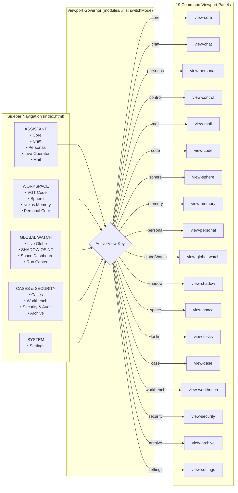
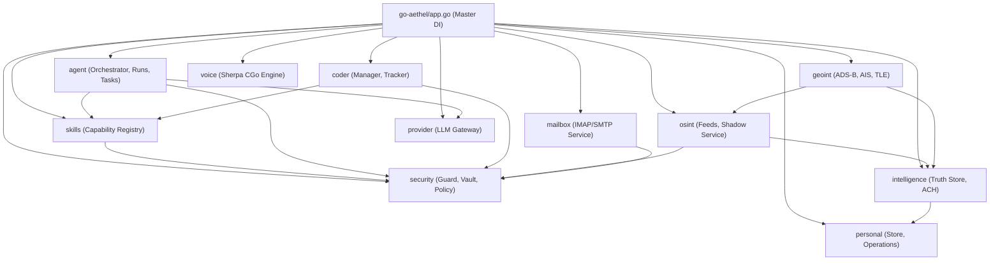
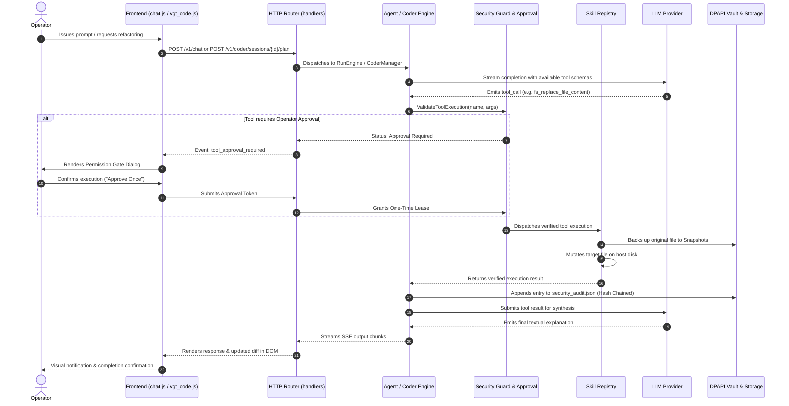

<!-- STATUS: DIAMANT VGT SUPREME -->
# VGT AETHEL // COMPLETE SYSTEM ARCHITECTURE & TECHNICAL CARTOGRAPHY

**Software Edition:** VGT AETHEL Beta V4 (`1.0.0-beta.4`)  
**Architecture Classification:** Sovereign Local-First AI Operating System & Strategic Intelligence Workspace  
**Primary Runtime Stack:** Go-Cortex 1.26.6 + Wails v2.15.0 Desktop Runtime (Chromium / WebView2)  
**Hardware & Security Boundary:** Zero External CDN, Windows DPAPI Hardware-Backed Vault, AES-256-GCM At-Rest Encryption, Local-First CGo Sherpa-ONNX Voice Pipeline  
**Document Purpose:** Authoritative, exhaustive technical architectural map detailing every directory, file, component, route, API endpoint, styling dependency, database interaction, security boundary, and data flow across the entire codebase.

---

## 1. Architecture Index

* [1. Architecture Index](#1-architecture-index)
* [2. Global Architecture Tree](#2-global-architecture-tree)
* [3. Mapping Files to Architecture](#3-mapping-files-to-architecture)
  * [3.1 Presentation & Desktop Runtime (`go-aethel/frontend/`)](#31-presentation--desktop-runtime-go-aethelfrontend)
  * [3.2 Backend Core & IPC Layer (`go-aethel/`)](#32-backend-core--ipc-layer-go-aethel)
  * [3.3 Autonomous Agent & Orchestration Engine (`go-aethel/agent/`)](#33-autonomous-agent--orchestration-engine-go-aethelagent)
  * [3.4 Autonomous Engineering Subsystem (`go-aethel/coder/`)](#34-autonomous-engineering-subsystem-go-aethelcoder)
  * [3.5 Intelligence & Global Watch Cortex (`go-aethel/intelligence/`)](#35-intelligence--global-watch-cortex-go-aethelintelligence)
  * [3.6 OSINT & SHADOW Military Intelligence Subsystem (`go-aethel/osint/`)](#36-osint--shadow-military-intelligence-subsystem-go-aethelosint)
  * [3.7 GEOINT & Spatial Tracking Subsystem (`go-aethel/geoint/`)](#37-geoint--spatial-tracking-subsystem-go-aethelgeoint)
  * [3.8 Personal Core & Operator Context (`go-aethel/personal/`)](#38-personal-core--operator-context-go-aethelpersonal)
  * [3.9 Secure Mailbox & Comms Engine (`go-aethel/mailbox/`)](#39-secure-mailbox--comms-engine-go-aethelmailbox)
  * [3.10 Sphere Operating Environment & Desktop OS (`go-aethel/sphere/`)](#310-sphere-operating-environment--desktop-os-go-aethelsphere)
  * [3.11 Offline Sherpa-ONNX Voice Pipeline (`go-aethel/voice/`)](#311-offline-sherpa-onnx-voice-pipeline-go-aethelvoice)
  * [3.12 Provider & Model Gateway (`go-aethel/provider/`)](#312-provider--model-gateway-go-aethelprovider)
  * [3.13 Security, Policy Engine & Vault (`go-aethel/security/`)](#313-security-policy-engine--vault-go-aethelsecurity)
  * [3.14 Typed Capability Skills Registry (`go-aethel/skills/`)](#314-typed-capability-skills-registry-go-aethelskills)
  * [3.15 System Diagnostics & Lifecycle (`go-aethel/system/`)](#315-system-diagnostics--lifecycle-go-aethelsystem)
  * [3.16 Omnichannel Gateway Bridge (`crates/vgt-bridge/`)](#316-omnichannel-gateway-bridge-cratesvgt-bridge)
  * [3.17 Next.js Modern Web Interface (`crates/vgt-ui/`)](#317-nextjs-modern-web-interface-cratesvgt-ui)
  * [3.18 Infrastructure & Deployment (`infrastructures/`)](#318-infrastructure--deployment-infrastructures)
* [4. Module Documentation](#4-module-documentation)
  * [Module: Security & Governance Subsystem](#module-security--governance-subsystem)
  * [Module: Autonomous Agent & Orchestrator](#module-autonomous-agent--orchestrator)
  * [Module: Autonomous Engineering Workspace (VGT Code)](#module-autonomous-engineering-workspace-vgt-code)
  * [Module: Intelligence Core & Global Watch Truth Model](#module-intelligence-core--global-watch-truth-model)
  * [Module: OSINT & SHADOW Military Intelligence Engine](#module-osint--shadow-military-intelligence-engine)
  * [Module: GEOINT & Geospatial Tracking Subsystem](#module-geoint--geospatial-tracking-subsystem)
  * [Module: Personal Core & Operator Operations](#module-personal-core--operator-operations)
  * [Module: Secure Encrypted Mailbox](#module-secure-encrypted-mailbox)
  * [Module: Sphere OS & Object Workspace](#module-sphere-os--object-workspace)
  * [Module: Offline Sherpa-ONNX Voice Pipeline](#module-offline-sherpa-onnx-voice-pipeline)
  * [Module: Multi-Provider LLM Gateway](#module-multi-provider-llm-gateway)
  * [Module: Typed Capabilities & Skills Registry](#module-typed-capabilities--skills-registry)
  * [Module: System Diagnostics, Snapshots & Release Management](#module-system-diagnostics-snapshots--release-management)
  * [Module: Omnichannel Messaging Bridge (VGT Bridge)](#module-omnichannel-messaging-bridge-vgt-bridge)
  * [Module: Standalone Next.js Web Console (VGT UI)](#module-standalone-nextjs-web-console-vgt-ui)
* [5. Detailed Dashboard Documentation](#5-detailed-dashboard-documentation)
  * [View 1: Neural Core (`view-core`)](#view-1-neural-core-view-core)
  * [View 2: Chat Workspace (`view-chat`)](#view-2-chat-workspace-view-chat)
  * [View 3: VGT Code Agent Workspace (`view-code`)](#view-3-vgt-code-agent-workspace-view-code)
  * [View 4: Personas Registry (`view-personas`)](#view-4-personas-registry-view-personas)
  * [View 5: Live-Operator Control (`view-control`)](#view-5-live-operator-control-view-control)
  * [View 6: E-Mail Command (`view-mail`)](#view-6-e-mail-command-view-mail)
  * [View 7: Sphere Desktop OS (`view-sphere`)](#view-7-sphere-desktop-os-view-sphere)
  * [View 8: Nexus Memory & Secrets (`view-memory`)](#view-8-nexus-memory--secrets-view-memory)
  * [View 9: Personal Core (`view-personal`)](#view-9-personal-core-view-personal)
  * [View 10: Live-Globus & OSINT Feeds (`view-global-watch`)](#view-10-live-globus--osint-feeds-view-global-watch)
  * [View 11: SHADOW OSINT Operations Mode (`view-shadow`)](#view-11-shadow-osint-operations-mode-view-shadow)
  * [View 12: Space Dashboard (`view-space`)](#view-12-space-dashboard-view-space)
  * [View 13: Run Center (`view-tasks`)](#view-13-run-center-view-tasks)
  * [View 14: Cases & Evidence Workspace (`view-case`)](#view-14-cases--evidence-workspace-view-case)
  * [View 15: Intelligence Operator Workbench (`view-workbench`)](#view-15-intelligence-operator-workbench-view-workbench)
  * [View 16: Security & Audit Command (`view-security`)](#view-16-security--audit-command-view-security)
  * [View 17: Chat Archive (`view-archive`)](#view-17-chat-archive-view-archive)
  * [View 18: System Settings (`view-settings`)](#view-18-system-settings-view-settings)
  * [View 19: Agent Builder (`view-agent`)](#view-19-agent-builder-view-agent)
  * [System Modals & Security Overlays](#system-modals--security-overlays)
* [6. CSS & UI Architecture](#6-css--ui-architecture)
  * [6.1 Styling Hierarchy & Design Tokens](#61-styling-hierarchy--design-tokens)
  * [6.2 CSS Files to Component & Page Mapping](#62-css-files-to-component--page-mapping)
* [7. API Architecture](#7-api-architecture)
* [8. System Data Flows](#8-system-data-flows)
  * [8.1 Chat Execution with Capability Invocation & Security Gate](#81-chat-execution-with-capability-invocation--security-gate)
  * [8.2 Real-Time OSINT Ingestion & Event Bus Distribution](#82-real-time-osint-ingestion--event-bus-distribution)
  * [8.3 SHADOW OSINT 40–60 Batch Ingestion & Conflict Graph](#83-shadow-osint-4060-batch-ingestion--conflict-graph)
  * [8.4 Autonomous Coding Session Execution (VGT Code)](#84-autonomous-coding-session-execution-vgt-code)
  * [8.5 Offline Voice Pipeline: Audio Ingestion to Speech Playback](#85-offline-voice-pipeline-audio-ingestion-to-speech-playback)
  * [8.6 Secure Mailbox IMAP Sync & Threat Scoring](#86-secure-mailbox-imap-sync--threat-scoring)
* [9. Core & Shared Dependencies](#9-core--shared-dependencies)
* [10. Architecture Relations (Mermaid Diagrams)](#10-architecture-relations-mermaid-diagrams)
  * [10.1 Global System Topology](#101-global-system-topology)
  * [10.2 Dashboard & Navigation Architecture](#102-dashboard--navigation-architecture)
  * [10.3 Backend Subsystem Dependency Graph](#103-backend-subsystem-dependency-graph)
  * [10.4 End-to-End Data & State Flow](#104-end-to-end-data--state-flow)
* [11. File References & Symbol Catalog](#11-file-references--symbol-catalog)
* [12. Architectural Anomalies & System Findings](#12-architectural-anomalies--system-findings)

---

## 2. Global Architecture Tree

```text
VGT AETHEL SYSTEM
│
├── Presentation & User Interface (Desktop / Web / Omnichannel)
│   ├── Wails Desktop Shell (Embedded WebEngine / WebView2)
│   │   ├── Shell Core (HTML5, ES6 Modules, Virtual Asset Server)
│   │   ├── Design Tokens & System Themes (Dark-First Glassmorphic Design System)
│   │   ├── Navigation & Viewport Governor (Mode Switcher, Layout Manager)
│   │   └── Modals & Security Overlays (Gate Approval, Setup Wizard, Handoff)
│   ├── Standalone Web Client (`crates/vgt-ui`: Next.js 15, React 19, Tailwind)
│   └── Omnichannel Message Gateway (`crates/vgt-bridge`: WhatsApp, Signal, TG, Discord, Matrix)
│
├── Viewport & Dashboard Command Surfaces (19 Operational Views)
│   ├── Assistant Domain
│   │   ├── Neural Core (`view-core`)
│   │   ├── Chat Workspace (`view-chat`)
│   │   ├── Personas Registry (`view-personas`)
│   │   ├── Live-Operator Control (`view-control`)
│   │   └── E-Mail Command (`view-mail`)
│   ├── Workspace Domain
│   │   ├── VGT Code Agent (`view-code`)
│   │   ├── Sphere Desktop OS (`view-sphere`)
│   │   ├── Nexus Memory (`view-memory`)
│   │   └── Personal Core (`view-personal`)
│   ├── Global Watch Domain
│   │   ├── Live-Globus & Feeds (`view-global-watch`)
│   │   ├── SHADOW OSINT (`view-shadow`)
│   │   ├── Space Dashboard (`view-space`)
│   │   └── Run Center (`view-tasks`)
│   ├── Cases & Security Domain
│   │   ├── Cases & Evidence (`view-case`)
│   │   ├── Intelligence Workbench (`view-workbench`)
│   │   ├── Security & Audit (`view-security`)
│   │   └── Chat Archive (`view-archive`)
│   └── System Configuration
│       ├── Settings Console (`view-settings`)
│       └── Agent Builder (`view-agent`)
│
├── Cognitive Intelligence & Strategic Analysis Layer
│   ├── Global Watch Nexus (`intelligence/`): Unified Truth Model, Events, Alerts, ACH Matrix
│   ├── SHADOW OSINT Engine (`osint/`): Military Doctrine, 40-60 Item Batches, Conflict Graph
│   ├── GEOINT Tracking (`geoint/`): Aircraft (ADS-B), Ships (AIS), Satellites (TLE), CCTV
│   └── Space Weather Analysis: NOAA SWPC Ingestion, SDO Solar Imager Proxy
│
├── Autonomous Agent & Orchestration Engine
│   ├── Intent Router & Profile Resolution (`agent/intent_router.go`)
│   ├── Chat Execution Loop & Streaming Engine (`agent/chat_agent.go`)
│   ├── Persistent Multi-Step Run Engine (`agent/run_engine.go`)
│   ├── Scheduled Task Engine (`agent/task_engine.go`)
│   └── Environmental Sentinel Daemon (`agent/sentinel_daemon.go`)
│
├── Autonomous Engineering Workspace (VGT Code)
│   ├── Coder Manager & Process Broker (`coder/manager.go`)
│   ├── Workspace AST & File Change Tracker (`coder/tracker.go`)
│   └── Multi-Session State Isolation (`./vgt_workspace/coder_sessions.sealed`)
│
├── Sovereign Personal & Communication Services
│   ├── Personal Core: Identity, Habits, Goals, Projects, Operations Queue (`personal/`)
│   ├── Secure Encrypted Mailbox: Verified TLS IMAP/SMTP, Phishing Analysis (`mailbox/`)
│   └── Offline Sherpa-ONNX Voice Pipeline: Local CGo ONNX Synthesizer & Transcriber (`voice/`)
│
├── Security, Policy & Vault Subsystem
│   ├── Capability Guard & Risk Classifier: Safe, Low, Medium, High, Critical (`security/guard.go`)
│   ├── Interactive Operator Approval Gate (`security/approval.go`)
│   ├── Time-Bounded Lease Manager (`security/context.go`)
│   ├── Clean-Room Process Broker (`security/process_broker.go`)
│   ├── SSRF & DNS-Rebinding Network Shield (`security/public_network.go`)
│   ├── Windows DPAPI Hardware-Backed Vault & AES-256-GCM Store (`security/secret.go`)
│   └── Immutable Chained Security Audit Logger (`security/kernel_log.go`)
│
├── Capability & Tool Execution Registry (`skills/`)
│   ├── File System & Project Mounts (`skills_fs.go`)
│   ├── System Process Execution (`skills_sys.go`)
│   ├── Native GUI & Window Automation (`skills_gui.go`)
│   ├── Private Web Browser (`skills_browser.go`)
│   ├── Intelligence & Global Watch Actions (`skills_intelligence.go`)
│   ├── Geospatial Entity Querying (`skills_geoint.go`)
│   ├── Encrypted Email Operations (`skills_mail.go`)
│   └── Sphere Workspace Operations (`skills_sphere.go`)
│
├── Multi-Provider AI Gateway (`provider/`)
│   ├── Local Offline Engine: Ollama (`provider/ollama.go`)
│   ├── Ultra-Low Latency Engine: Groq
│   ├── Reasoning & Coding Engines: DeepSeek (Reasoner/Coder), Anthropic Claude
│   ├── Frontier Generalist Engines: OpenAI (GPT-4o, o1, o3), Google Gemini
│   └── Provider Registry, Health Probes & Dynamic Discovery (`provider_registry.go`)
│
└── Persistent Workspace & Data Stores (`./vgt_workspace/`)
    ├── Sealed Configuration (`aethel_config.json`, AES-256-GCM)
    ├── Master Hardware Key & Vault (`vault.key`, `secret_vault.enc`)
    ├── Audit Log Chain (`security_audit.json`)
    ├── Active Capability Leases (`active_leases.json`)
    ├── Operator Approvals (`approval_grants.json`)
    ├── Personal Core Profile & Inbox (`personal/`, `personal/operations.enc`)
    ├── Unified Intelligence Truth Store (`intel_shared.json`, `intelligence_reports/`)
    ├── SHADOW OSINT Encrypted State (`shadow_osint.enc`)
    ├── Persistent Runs & Tasks (`agent_runs.json`, `tasks.json`)
    ├── Encrypted Mail Storage (`mail_account.enc`)
    ├── Offline Sherpa Models & Audio Output (`models/sherpa/`, `audio/`)
    └── Parquet Analytical Datasets (`parquet-go` on Windows, DuckDB on POSIX)
```

---

## 3. Mapping Files to Architecture

### 3.1 Presentation & Desktop Runtime (`go-aethel/frontend/`)
* **Shell & Core Bootstrap:**
  * `go-aethel/frontend/index.html` - Master single-page desktop viewport hosting 19 dashboard views, 5 modal overlays, system HUD, and embedded stylesheets.
  * `go-aethel/frontend/app.js` - Primary client bootstrap, module wiring, view router registration, keyboard handlers, and periodic status refresh timers.
  * `go-aethel/frontend/marked.min.js` - Self-hosted Markdown parser for rendering chat responses, dossiers, and briefings without external CDNs.
* **Core Modules:**
  * `go-aethel/frontend/modules/state.js` - Global client-side reactive state container holding views, nav buttons, active provider models, leases, and system flags.
  * `go-aethel/frontend/modules/ui.js` - Master mode switcher (`switchMode`), setup wizard handlers, model selector hydrators, and cost accounting display.
  * `go-aethel/frontend/modules/api.js` - Centralized HTTP client wrapper executing authenticated REST calls against `state.API_BASE`.
  * `go-aethel/frontend/modules/i18n.js` - Multi-language translation engine (DE, EN, ES, FR, RU) with client-side dictionary replacement.
  * `go-aethel/frontend/modules/ui_modernization.js` - Micro-interactions, dynamic tooltip positioning, and responsive viewport adjustments.
  * `go-aethel/frontend/modules/approval_dialog.js` - Security gate modal logic intercepting critical tool calls and requesting human approval.
  * `go-aethel/frontend/modules/run_approval_monitor.js` - Background polling loop detecting pending tool executions across active agent runs.
  * `go-aethel/frontend/modules/intelligence_alert_monitor.js` - Server-Sent Events (SSE) listener binding `/v1/intelligence/stream` to desktop notifications.
  * `go-aethel/frontend/modules/startup_briefing.js` - Audio-visual intelligence briefing executed after operator dismisses startup splash.
  * `go-aethel/frontend/modules/startup_greeting.js` - Personalized greeting using Sherpa-ONNX TTS based on operator profile name.
  * `go-aethel/frontend/modules/emergency_overlay.js` - Sentinel alert system displaying fullscreen warning dialogs during high-severity physical threats.
* **Specialized View Modules:**
  * `go-aethel/frontend/modules/chat.js` - Interactive chat streaming, SSE parser, session persistence, message formatting, and attachment handlers.
  * `go-aethel/frontend/modules/chat_addmessage.js` - DOM message builder isolating syntax-highlighted code blocks, tool executions, and badges.
  * `go-aethel/frontend/modules/vgt_code.js` - Autonomous software engineering workspace, project file tree, Monaco/code viewer, and terminal runner.
  * `go-aethel/frontend/modules/shadow_osint.js` - Strategic-command OSINT console, system doctrine editor, 40-60 batch analyzer, and daily dossier generator.
  * `go-aethel/frontend/modules/shadow_globe.js` - Dedicated WebGL 3D globe displaying regional threat heatmaps and animated conflict vectors.
  * `go-aethel/frontend/modules/space_dashboard.js` - Real-time space weather monitor, solar flare gauges, geomagnetic indices, and SDO solar imagery.
  * `go-aethel/frontend/modules/case_workspace.js` - Intelligence case management, entity relationship graph builder, and forensic evidence registry.
  * `go-aethel/frontend/modules/operator_workbench.js` - Analytical workbench featuring hypothesis matrices, entity resolution review, and gap analysis.
  * `go-aethel/frontend/modules/workbench_dom.js`, `workbench_views.js`, `workbench_analysis_actions.js` - Sub-components supporting the operator workbench.
  * `go-aethel/frontend/modules/control.js` - Host automation console, real-time screen capture preview, and direct mouse/keyboard skill dispatch.
  * `go-aethel/frontend/modules/mail_workspace.js` - Complete email client, inbox/folder navigation, thread reader, composer, and security inspector.
  * `go-aethel/frontend/modules/personal_mode.js` - Personal Core configuration, lifestyle habit tracker, operator values editor, and profile management.
  * `go-aethel/frontend/modules/personal_operations.js` - Operational notifications queue, actionable approvals, and proactive reminder cards.
  * `go-aethel/frontend/modules/memory.js` - Vector semantic memory inspector, episodic memory search, and deletion tools.
  * `go-aethel/frontend/modules/secrets.js` - Secret vault UI for managing encrypted credentials, API keys, and environment variables.
  * `go-aethel/frontend/modules/security.js` - Security status HUD, active permission lease manager, and cryptographic hash-chain audit viewer.
  * `go-aethel/frontend/modules/tasks.js` - Autonomous background task manager, cron scheduler, and run queue monitor.
  * `go-aethel/frontend/modules/settings.js` - Model provider configuration, API key entry, persona builder, and cost budget limits.
  * `go-aethel/frontend/modules/agent_builder.js` - Custom agent persona definition console, capability assignment, and prompt engineering tools.
  * `go-aethel/frontend/modules/voice.js` - Sherpa-ONNX voice selector, audio playback queue, microphone STT listener, and wake word detector.
* **Global Watch & Geospatial Modules (`go-aethel/frontend/modules/osint/` & `geo_renderer/`):**
  * `osint/feed_and_risks.js` - Real-time RSS/Atom feed viewer, regional risk catalog loader, and severity filters.
  * `osint/briefing_and_reader.js` - Automated intelligence briefing renderer and reader-view article sanitizer.
  * `osint/ui_controls.js` - Layer filter checkboxes, time window sliders, manual refresh buttons, and search inputs.
  * `osint/layers.js`, `osint/projection.js`, `osint/state.js`, `osint/texture_atlas.js` - Map coordinate projections, equirectangular canvas texture bakes, and layer state.
  * `geo_renderer/enhanced_cesium_renderer.js` - High-performance Cesium WebGL globe integration, local tile rendering, and entity management.
  * `geo_renderer/geo_entity_renderer.js` - 3D model positioning for aircraft, naval vessels, and satellite orbital paths.
  * `geo_renderer/aircraft_icons.js`, `geo_camera_controller.js`, `geo_layer_manager.js`, `quality_profiles.js` - Camera animations, LOD governors, and icons.
* **Sphere Desktop Environment (`go-aethel/frontend/modules/sphere/`):**
  * `sphere/index.js`, `desktop.js`, `window_manager.js` - Floating window manager, taskbar, layout persistence, and z-index governor.
  * `sphere/app_registry.js`, `command_palette.js`, `context_bus.js`, `object_model.js`, `sidecar.js` - App launcher, global command palette, and cross-app context sharing.
  * `sphere/apps/*.js` - 15 built-in apps: `browser.js`, `console.js`, `dashboard.js`, `files.js`, `live.js`, `mail.js`, `markets.js`, `notes.js`, `planner.js`, `research.js`, `runs.js`, `terminal.js`, `travel.js`, `weather.js`, `writer.js`.
* **Static Assets & 3D Models (`go-aethel/frontend/assets/` & `vendor/`):**
  * `assets/earth_day.jpg`, `assets/earth_day_8k.jpg` - High-resolution equirectangular basemap textures for offline 3D globe rendering.
  * `assets/world-atlas-110m.topojson` - Self-hosted TopoJSON country boundaries for vector layer rendering.
  * `assets/models/*.glb` - 9 offline 3D glTF/GLB models (`airplane.glb`, `atr72.glb`, `b789.glb`, `bell206.glb`, `c172.glb`, `citation2.glb`, `jet.glb`, `mq9.glb`, `ship.glb`).
  * `vendor/cesium/Cesium.js` - Complete, air-gapped, self-hosted CesiumJS geospatial graphics runtime.
* **Generated Wails IPC Stubs (`go-aethel/frontend/wailsjs/`):**
  * `wailsjs/go/main/App.js` & `App.d.ts` - TypeScript & JavaScript bindings generated by Wails for calling Go methods on `App`.

---

### 3.2 Backend Core & IPC Layer (`go-aethel/`)
* `go-aethel/main.go` - Native application entrypoint, Wails window initialization (`wails.Run`), asset server attachment, panic recovery, and persistent workspace bootstrap.
* `go-aethel/app.go` - Master dependency injection wiring, service lifecycle startup (`startup`), native directory picker bindings, and virtual HTTP router (`APIRouter`).
* `go-aethel/config.go` - Application configuration loader, environment variable resolution, provider key parsing, and secure JSON storage in `vgt_workspace`.
* `go-aethel/runtime_workspace.go` - Workspace filesystem initialization, creating `./vgt_workspace` and its protected subdirectories (`personal`, `models`, `audio`, etc.).
* `go-aethel/server_utils.go` - HTTP utility helpers for JSON encoding, error responses, and request body size bounding.
* `go-aethel/runtime_mode_app.go` & `runtime_mode_bindings.go` - Build constraints distinguishing full desktop binary builds from bindings generation builds.
* `go-aethel/wails.json` - Wails build configuration defining project identity, output binary names, asset directory, and frontend build commands.

---

### 3.3 Autonomous Agent & Orchestration Engine (`go-aethel/agent/`)
* `go-aethel/agent/intent_router.go` - First-principles intent classifier (`ResolveChatAgentProfile`), deciding whether user input is pure chit-chat, strategic query, or multi-step tool run.
* `go-aethel/agent/chat_agent.go` - Core conversational agent loop, invoking LLM providers, receiving streamed chunks, detecting tool calls, and coordinating execution.
* `go-aethel/agent/prompt.go` - Dynamic system prompt generator injecting VGT operational doctrine, host platform capabilities, Personal Core context, and security rules.
* `go-aethel/agent/run_engine.go` - Robust multi-step agent run orchestrator (`RunEngine`), managing state transitions (`pending`, `running`, `paused`, `completed`), step limits, and evidence recording.
* `go-aethel/agent/task_engine.go` - Scheduled task runner (`TaskEngine`) executing recurrent and delayed background operations, integrated with Personal Operations notifications.
* `go-aethel/agent/sentinel_daemon.go` - Proactive environmental sentinel (`SharedSentinel`), polling weather anomalies, earthquakes, and proximity hazards relative to operator home coordinates.
* `go-aethel/agent/capability_catalog.go` - Schema definitions translating internal Go capability structs into compact, token-efficient JSON schemas presented to models.
* `go-aethel/agent/continuity.go` - Context management and session continuity engine preserving execution context across agent pauses and restarts.
* `go-aethel/agent/context.go` - State bag and dependency references injected into agent execution loops.

---

### 3.4 Autonomous Engineering Subsystem (`go-aethel/coder/`)
* `go-aethel/coder/manager.go` - Coder session manager (`Manager`), creating isolated coding sessions, supervising process broker execution, and managing git/workspace boundaries.
* `go-aethel/coder/tracker.go` - Change tracker (`WorkspaceTracker`), scanning workspace ASTs, tracking modified files, computing Unified Diffs, and coordinating rollbacks.
* `go-aethel/coder/types.go` - Data structures representing coder sessions, execution commands, diff blocks, file patch operations, and status reports.
* `go-aethel/coder/process_windows.go` & `process_other.go` - Platform-specific process spawn isolation attaching processes to Windows Job Objects with zero ambient environment secrets.

---

### 3.5 Intelligence & Global Watch Cortex (`go-aethel/intelligence/`)
* `go-aethel/intelligence/store.go` - Unified truth model (`SharedIntelStore`), ingesting raw observations, clustering events, storing assessments, and tracking regional risk scores.
* `go-aethel/intelligence/data_model.go` - Core entity models: `Observation`, `IntelligenceEvent`, `Assessment`, `Evidence`, `RegionalRiskScore`, `Case`, `Hypothesis`, `Claim`.
* `go-aethel/intelligence/bus.go` & `intelligence_bus.go` - Lock-free pub/sub in-memory event bus broadcasting real-time intelligence events to SSE subscribers.
* `go-aethel/intelligence/canonical_adapter.go` - Compatibility adapter exposing standard intelligence query interfaces to the REST handler layer.
* `go-aethel/intelligence/ach.go` - Analysis of Competing Hypotheses (ACH) engine, managing hypothesis-evidence consistency matrices and calculating diagnostics scores.
* `go-aethel/intelligence/entity_resolution.go` - Cross-feed entity resolver detecting duplicate aliases, calculating Jaro-Winkler/Levenshtein similarity, and suggesting merge links.
* `go-aethel/intelligence/evidence_vault.go` - SHA-256 evidence integrity vault ensuring ingested reports and artifacts are tamper-evident.
* `go-aethel/intelligence/state_journal.go` - Cryptographically chained state journal tracking every mutation of the intelligence database.
* `go-aethel/intelligence/search.go`, `search_index.go`, `semantic_index.go` - In-memory inverted index and vector search engine for finding relevant historical observations.
* `go-aethel/intelligence/regional_risk_catalog.go` & `regions.go` - Master geopolitical catalog mapping ISO country codes, coordinates, and regional risk histories.
* `go-aethel/intelligence/analytics_windows.go` & `analytics_duckdb.go` - High-speed analytical engine: Parquet columnar reader (`parquet-go`) on Windows; DuckDB SQL engine on POSIX.
* `go-aethel/intelligence/briefings/briefings.go` - Automated situational briefing generator assembling multi-source summaries.
* `go-aethel/intelligence/cases/cases.go` - Case file lifecycle manager, associating suspects, organizations, events, and evidence.
* `go-aethel/intelligence/alerts/alerts.go` - Rule-based and AI-triggered alert evaluation system.
* `go-aethel/intelligence/connectors/connectors.go` - External data connector interface and registry.

---

### 3.6 OSINT & SHADOW Military Intelligence Subsystem (`go-aethel/osint/`)
* `go-aethel/osint/osint_engine.go` - Multi-feed RSS/Atom collector (`OSINTEngine`), polling configured open-source newsfeeds and normalizing raw XML entries.
* `go-aethel/osint/shadow_service.go` - Military OSINT analysis service (`ShadowService`), enforcing strict 40–60 item batching, autonomous evaluations, and persistence in `shadow_osint.enc`.
* `go-aethel/osint/shadow_prompt.go` - Rigid epistemic prompt doctrine forbidding speculation and enforcing strict citation of batch evidence.
* `go-aethel/osint/shadow_sources.go` - Curated registry of military, geopolitical, aerospace, and critical infrastructure sources.
* `go-aethel/osint/collector_telegram.go` - Public Telegram web preview scraper extracting real-time field reports from military channels without requiring API bots.
* `go-aethel/osint/collector_hazard_json.go` - GeoJSON collector for USGS Earthquake API and NASA EONET volcanic activity feeds.
* `go-aethel/osint/collector_web_index.go` - Bounded same-origin headline collector discovering feed links on institutional press sites.
* `go-aethel/osint/article_reader.go` - Clean-text article extractor stripping boilerplate, advertisements, and navigation DOM elements.
* `go-aethel/osint/domain_investigation.go` - Network reconnaissance engine performing DNS lookups, WHOIS parsing, and Certificate Transparency log audits.
* `go-aethel/osint/global_watch_monitor.go` - Background daemon executing scheduled briefings, regional evaluations, and dossier exports.

---

### 3.7 GEOINT & Spatial Tracking Subsystem (`go-aethel/geoint/`)
* `go-aethel/geoint/service.go` - Central geospatial intelligence engine (`GeoIntService`), managing active tracking feeds and spatial indexing.
* `go-aethel/geoint/bus.go` - High-frequency geospatial event bus distributing coordinate updates.
* `go-aethel/geoint/types.go` - Structs representing aircraft, naval vessels, orbital satellites, CCTV cameras, and hazard coordinates.
* `go-aethel/geoint/collectors_aircraft.go` - Live aircraft transponder tracker integrating OpenSky Network ADS-B data streams.
* `go-aethel/geoint/collectors_vessels.go` - Maritime vessel tracker parsing AIS positions and navigational statuses.
* `go-aethel/geoint/collectors_satellites.go` - NORAD/CelesTrak Two-Line Element (TLE) satellite tracker calculating real-time orbital paths.
* `go-aethel/geoint/collectors_cctv.go` - Public traffic and municipal CCTV surveillance camera connector with frame capture capabilities.
* `go-aethel/geoint/collectors_hazards.go` - Real-time spatial mapping of natural disasters, tsunamis, and severe weather.
* `go-aethel/geoint/correlation.go` - Geospatial correlation engine detecting proximity between tracked assets and active conflict or hazard zones.
* `go-aethel/geoint/shadow_adapter.go` - Adapter projecting SHADOW conflict links as animated 3D great-circle arcs on the globe.

---

### 3.8 Personal Core & Operator Context (`go-aethel/personal/`)
* `go-aethel/personal/personal.go` - Operator identity store (`PersonalStore`), managing encrypted profile details, work projects, personal goals, and core values.
* `go-aethel/personal/operations.go` - Personal operations queue (`OperationsStore`), persisting notifications, high-priority warnings, and required acknowledgments in `operations.enc`.
* `go-aethel/personal/context.go` - Assembler synthesizing operator context into compact prompts injected into LLM sessions.

---

### 3.9 Secure Mailbox & Comms Engine (`go-aethel/mailbox/`)
* `go-aethel/mailbox/service.go` - Secure email service (`MailService`), executing verified TLS IMAP connections and TLS/STARTTLS SMTP delivery using credentials from `SecretVault`.
* `go-aethel/mailbox/secure_store.go` - Encrypted on-disk cache storing email headers, folder hierarchies, and message bodies.
* `go-aethel/mailbox/message_analysis.go` - Phishing and tracking analyzer detecting suspicious sender domains, SPF/DKIM validation failures, and tracking pixels.

---

### 3.10 Sphere Operating Environment & Desktop OS (`go-aethel/sphere/`)
* `go-aethel/sphere/service.go` - Sphere subsystem service managing workspace virtualization and object state.
* `go-aethel/sphere/object_store.go` - Unified multi-modal storage holding documents, plans, clips, bookmarks, and trip itineraries.
* `go-aethel/sphere/types.go` - Type system defining Sphere workspace objects, links, and operational actions.
* `go-aethel/sphere/documents/document_engine.go` - Collaborative markdown editor backend supporting proposed edits and diff patching.
* `go-aethel/sphere/planner/planner_engine.go` - Strategic planning and task dependency tree engine.
* `go-aethel/sphere/research/research_engine.go` - Research clipping aggregator and automated dossier synthesis engine.
* `go-aethel/sphere/travel/travel_engine.go` - Travel itinerary engine evaluating regional security risk for planned routes.
* `go-aethel/sphere/browser/browser_session.go` - Headless browser session controller for secure research.

---

### 3.11 Offline Sherpa-ONNX Voice Pipeline (`go-aethel/voice/`)
* `go-aethel/voice/voice.go` - Audio subsystem orchestrator (`VoiceRegistry`), managing TTS/STT pipelines and fallback mechanisms.
* `go-aethel/voice/voice_sherpa_cgo.go` - High-performance offline text-to-speech engine using native CGo bindings to `onnxruntime.dll` and `sherpa-onnx-c-api.dll`.
* `go-aethel/voice/voice_sherpa_stub.go` - Fallback stub allowing compilation on environments where CGo or Sherpa dynamic libraries are absent.
* `go-aethel/sherpa-onnx-go-windows/` - Embedded Go bindings and architecture definitions (`build_windows_amd64.go`) for Windows ONNX runtime.

---

### 3.12 Provider & Model Gateway (`go-aethel/provider/`)
* `go-aethel/provider/provider_registry.go` - Multi-provider routing registry (`ProviderRegistry`), normalizing request/response schemas across Groq, OpenAI, Anthropic, Gemini, DeepSeek, and local Ollama.
* `go-aethel/provider/ollama.go` - Local Ollama detection daemon, model inventory scanner, and health monitor.
* `go-aethel/provider/urls.go` - Default API endpoints and endpoint URL resolution logic.

---

### 3.13 Security, Policy Engine & Vault (`go-aethel/security/`)
* `go-aethel/security/guard.go` - Authoritative capability guard (`SecurityGuard`), classifying risks (`RiskSafe` to `RiskCritical`), checking argument jails, and detecting injection patterns.
* `go-aethel/security/approval.go` - Operator approval manager (`ApprovalManager`), persisting one-time authorization tokens in `approval_grants.json`.
* `go-aethel/security/sealed_store.go` - Tamper-evident AES-256-GCM authenticated store for sensitive runtime states.
* `go-aethel/security/secret.go` - Encrypted secret vault (`SecretVault`) storing external provider API keys and IMAP passwords.
* `go-aethel/security/key_store_windows.go` & `key_store_other.go` - Hardware/OS key store using Windows DPAPI (`CryptProtectData` / `CryptUnprotectData`) to encrypt the master vault key.
* `go-aethel/security/process_broker.go` & `process_isolation_windows.go` - Process execution jail executing sub-commands in stripped environments without inheriting environment secrets.
* `go-aethel/security/public_network.go` - Network security guard preventing SSRF, DNS rebinding, and loopback/internal IP address evasion during web fetching.
* `go-aethel/security/kernel_log.go` - Cryptographic hash-chained audit logger (`AuditLogger`), recording tool calls and security decisions in `security_audit.json`.

---

### 3.14 Typed Capability Skills Registry (`go-aethel/skills/`)
* `go-aethel/skills/skills.go` - Central capability registry (`SkillRegistry`), binding typed capability handlers to model-invocable schemas.
* `go-aethel/skills/skills_fs.go` - File system capabilities: `fs_read_file`, `fs_write_file`, `fs_replace_file_content`, `fs_list_dir`, `fs_mount_folder`.
* `go-aethel/skills/skills_sys.go` - Host command capability: `sys_exec_cmd`.
* `go-aethel/skills/skills_gui.go` - Screen capture and window manipulation: `gui_control`, `gui_window_control`, `vision_context`.
* `go-aethel/skills/skills_browser.go` - Sandboxed web navigation: `browser_navigate`.
* `go-aethel/skills/skills_intelligence.go` - 30+ intelligence capabilities (`global_watch_nexus_context`, `intel_propose_observation`, `intel_generate_brief`, etc.).
* `go-aethel/skills/skills_geoint.go` - Spatial queries: `geo_contacts_nearest`, `geo_track`, `geo_focus`, `geo_correlate`, `geo_cctv_lookup`.
* `go-aethel/skills/skills_mail.go` - Email skills: `mail_list_messages`, `mail_send_message`, `mail_read_message`, `mail_manage`.
* `go-aethel/skills/skills_sphere.go` - Sphere object manipulation: `sphere_write_document`, `sphere_manage_plan`, `sphere_manage_trip`, etc.
* `go-aethel/skills/skills_memory.go` - Nexus memory persistence: `nexus_memory_save`, `nexus_memory_recall`, `personal_memory_save`.
* `go-aethel/skills/skills_market.go` - Financial ticker lookups: `market_quotes`.
* `go-aethel/skills/skills_weather.go` - Meteorological snapshot lookups: `weather_lookup`.
* `go-aethel/skills/skills_cartography.go` - Codebase architecture inspection: `code_cartography`.
* `go-aethel/skills/skills_handoff.go` - Context payload export for external IDEs: `external_agent_handoff`.

---

### 3.15 System Diagnostics & Lifecycle (`go-aethel/system/`)
* `go-aethel/system/product.go` - Product identity constants defining `ProductVersion` (`1.0.0-beta.4`) and codename.
* `go-aethel/system/diagnostics.go` - System diagnostics collector assembling system health dumps.
* `go-aethel/system/file_snapshots.go` - Automatic rollback snapshot engine backing up files before in-place model mutations.
* `go-aethel/system/release_service.go` - Version check and release update notification service.

---

### 3.16 Omnichannel Gateway Bridge (`crates/vgt-bridge/`)
* `crates/vgt-bridge/src/main.ts` - Omnichannel bridge daemon bootstrapping messaging providers.
* `crates/vgt-bridge/src/core/bridge.ts` - Master bridge router connecting external chat channels to Aethel Core via WebSocket.
* `crates/vgt-bridge/src/channels/whatsapp.ts` - WhatsApp connection provider using `@whiskeysockets/baileys`.
* `crates/vgt-bridge/src/core/telegram.ts` - Telegram bot listener using `grammY`.
* `crates/vgt-bridge/src/core/discord.ts` - Discord bot gateway using `discord.js`.
* `crates/vgt-bridge/src/core/signal.ts` - Signal messenger integration daemon.
* `crates/vgt-bridge/src/core/matrix.ts` - Decentralized Matrix protocol connector using `matrix-js-sdk`.
* `crates/vgt-bridge/src/core/bluebubbles.ts` & `teams.ts` - iMessage and Microsoft Teams messaging bridges.

---

### 3.17 Next.js Modern Web Interface (`crates/vgt-ui/`)
* `crates/vgt-ui/app/page.tsx` - Standalone web portal page rendering model controls, system telemetry, and chat workspace.
* `crates/vgt-ui/app/layout.tsx` & `globals.css` - Global React 19 layout, dark theme tokens, and Tailwind directives.
* `crates/vgt-ui/hooks/useVgtEngine.ts` - Custom React hook implementing streaming inference, tool call processing, and abort control against `http://localhost:3000`.
* `crates/vgt-ui/components/chat/*` - React chat stream components, tool call approval chips, and markdown formatters.
* `crates/vgt-ui/components/dashboard/*` - Hardware monitor gauges, model selector cards, and latency graphs.

---

### 3.18 Infrastructure & Deployment (`infrastructures/`)
* `docker-compose.yaml` - Container deployment orchestrating the neural core backend and web UI.
* `infrastructures/docker/Dockerfile.api` - Container definition for the API service.
* `infrastructures/docker/Dockerfile.ui` - Container definition for the standalone web console.

---

## 4. Module Documentation

### Module: Security & Governance Subsystem

#### Purpose
Authoritatively enforces the principle of least privilege, manages cryptographic keys via hardware-backed OS mechanisms, executes dangerous operations within isolated process sandboxes, and records an immutable cryptographic audit log for all system mutations.

#### Capabilities
* Enforces risk-based capability categorization: `RiskSafe`, `RiskLow`, `RiskMedium`, `RiskHigh`, `RiskCritical`.
* Intercepts dangerous operations and halts execution until an explicit operator approval token is granted.
* Issues time-bounded leases for automated workflows (15 minutes, 1 hour).
* Provides clean-room process execution via OS job objects, wiping API keys and credentials from sub-process environments.
* Defends against SSRF, loopback access, and DNS rebinding attacks when fetching external URLs.
* Encrypts and decrypts secret data using AES-256-GCM with keys sealed via Windows Data Protection API (DPAPI).
* Maintains a cryptographically chained, tamper-evident hash log (`SHA-256`) of every action.

#### Associated Files
* **Backend:** `go-aethel/security/guard.go`, `go-aethel/security/approval.go`, `go-aethel/security/secret.go`, `go-aethel/security/sealed_store.go`, `go-aethel/security/process_broker.go`, `go-aethel/security/process_isolation_windows.go`, `go-aethel/security/public_network.go`, `go-aethel/security/kernel_log.go`, `go-aethel/security/key_store_windows.go`
* **API:** `go-aethel/handlers/security_handlers.go`
* **Frontend:** `go-aethel/frontend/modules/security.js`, `go-aethel/frontend/modules/approval_dialog.js`
* **Styles:** `go-aethel/frontend/style.css`, `go-aethel/frontend/aethel-ui-production.css`
* **Database / Persistence:** `./vgt_workspace/security_audit.json`, `./vgt_workspace/active_leases.json`, `./vgt_workspace/approval_grants.json`, `./vgt_workspace/secret_vault.enc`, `./vgt_workspace/vault.key`
* **Tests:** `go-aethel/security/approval_test.go`, `go-aethel/security/guard_mapping_test.go`, `go-aethel/security/key_store_windows_test.go`, `go-aethel/security/lease_store_test.go`, `go-aethel/security/process_broker_test.go`, `go-aethel/security/public_network_test.go`, `go-aethel/security/vault_migration_test.go`, `go-aethel/verify_security_test.go`

#### Dashboard Integration
* Integrated into **Security & Audit (`view-security`)** displaying active leases, current security mode, and chronological audit log entries.
* Integrated into the top **System Status HUD** showing integrity indicators and active lease counts.
* Integrated into **Permission Gate Modal (`#permission-gate-modal`)** intercepting execution when a tool call requires operator sign-off.

#### Dependencies
```text
Security & Governance Subsystem
├── requires Windows DPAPI (CryptProtectData)
├── writes to ./vgt_workspace/security_audit.json
└── utilizes crypto/cipher, crypto/aes, crypto/sha256
```

#### Used By
* Autonomous Agent & Orchestrator (evaluates tool execution policies)
* Autonomous Engineering Subsystem (constrains command execution and file writes)
* Capabilities Registry (checks execution permissions for all tools)
* Mailbox & Comms Engine (retrieves sealed IMAP/SMTP credentials)
* HTTP Handlers (authenticates API requests and manages leases)

---

### Module: Autonomous Agent & Orchestrator

#### Purpose
Acts as the central cognitive engine that classifies operator intent, selects dynamic system prompts, maintains execution context, streams model responses, and supervises multi-step autonomous tool execution with rollback capabilities.

#### Capabilities
* Deterministic intent classification into conversation, analytical query, or autonomous tool execution.
* Compaction and token optimization of tool schemas based on run objectives.
* Multi-step autonomous plan execution with state checkpointing (`pending`, `running`, `paused`, `completed`, `failed`).
* Step-by-step evidence verification requiring verified effects before acknowledging objective completion.
* Background scheduled task execution and periodic health monitoring.
* Environmental hazard monitoring via the Sentinel daemon.

#### Associated Files
* **Backend:** `go-aethel/agent/intent_router.go`, `go-aethel/agent/chat_agent.go`, `go-aethel/agent/prompt.go`, `go-aethel/agent/run_engine.go`, `go-aethel/agent/task_engine.go`, `go-aethel/agent/sentinel_daemon.go`, `go-aethel/agent/capability_catalog.go`, `go-aethel/agent/continuity.go`
* **API:** `go-aethel/handlers/chat_handlers.go`, `go-aethel/handlers/chat_agent_handlers.go`, `go-aethel/handlers/runs_handlers.go`, `go-aethel/handlers/tasks_handlers.go`
* **Frontend:** `go-aethel/frontend/modules/chat.js`, `go-aethel/frontend/modules/chat_addmessage.js`, `go-aethel/frontend/modules/tasks.js`, `go-aethel/frontend/modules/emergency_overlay.js`
* **Styles:** `go-aethel/frontend/style.css`, `go-aethel/frontend/vgt-components.css`
* **Database / Persistence:** `./vgt_workspace/agent_runs.json`, `./vgt_workspace/tasks.json`
* **Tests:** `go-aethel/agent/chat_agent_logic_test.go`, `go-aethel/agent/continuity_test.go`, `go-aethel/agent/personal_operations_routing_test.go`, `go-aethel/agent/prompt_compaction_test.go`, `go-aethel/agent/run_engine_test.go`, `go-aethel/agent/sentinel_location_test.go`, `go-aethel/agent/task_engine_security_test.go`, `go-aethel/chat_agent_integration_test.go`

#### Dashboard Integration
* Powers the **Chat Workspace (`view-chat`)** via Server-Sent Events (SSE) streaming.
* Powers the **Run Center (`view-tasks`)** displaying active multi-step autonomous missions, step logs, and pause/resume controls.
* Controls the **Emergency Alert Overlay (`#emergency-overlay`)** triggered when Sentinel detects nearby earthquakes or extreme weather.

#### Dependencies
```text
Autonomous Agent & Orchestrator
├── requires Security Policy Engine (verifies tool calls)
├── requires Capability Registry (dispatches tools)
├── requires Provider Registry (executes LLM completions)
├── reads Personal Core Store (injects operator context)
└── persists to ./vgt_workspace/agent_runs.json
```

#### Used By
* Chat Workspace (`view-chat`)
* Run Center (`view-tasks`)
* VGT Code Agent Workspace (`view-code`)
* Emergency Alert Overlay (`emergency_overlay.js`)

---

### Module: Autonomous Engineering Workspace (VGT Code)

#### Purpose
Provides an integrated, agent-driven software development environment capable of inspecting project directories, maintaining file change trackers, generating unified diffs, and executing builds within isolated environments.

#### Capabilities
* Safe project directory mounting with user approval and path canonicalization.
* Recursive file tree scanning with depth limits, ignoring `.git` and build artifacts.
* In-place file reading and atomic patch replacement with automatic file snapshot creation.
* Multi-session agent tracking maintaining an isolated session journal in `coder_sessions.sealed`.
* Execution of development commands with output streaming and terminal emulation.

#### Associated Files
* **Backend:** `go-aethel/coder/manager.go`, `go-aethel/coder/tracker.go`, `go-aethel/coder/types.go`, `go-aethel/coder/process_windows.go`, `go-aethel/coder/process_other.go`
* **API:** `go-aethel/handlers/coder_handlers.go`, `go-aethel/handlers/code_workspace_handlers.go`
* **Frontend:** `go-aethel/frontend/modules/vgt_code.js`
* **Styles:** `go-aethel/frontend/vgt-code.css`, `go-aethel/frontend/styles/vgt-code.css`
* **Database / Persistence:** `./vgt_workspace/coder_sessions.sealed`, file snapshots in `./vgt_workspace/snapshots/`
* **Tests:** `go-aethel/coder/manager_test.go`, `go-aethel/coder/tracker_test.go`, `go-aethel/handlers/code_workspace_handlers_test.go`

#### Dashboard Integration
* Exclusively powers **VGT Code (`view-code`)**, featuring an interactive file tree sidebar, Monaco-style editor surface, agent session chat, and terminal log runner.

#### Dependencies
```text
VGT Code Subsystem
├── requires Security Guard (validates directory jail)
├── requires File Snapshot Store (backs up files before edit)
├── requires Process Broker (executes compiler and test commands)
└── persists to ./vgt_workspace/coder_sessions.sealed
```

#### Used By
* VGT Code View (`view-code`)
* Agent Builder (`view-agent`, routed via code workspace team mode)

---

### Module: Intelligence Core & Global Watch Truth Model

#### Purpose
Acts as the central knowledge graph and truth repository for global events, intelligence observations, entity resolution, competing hypothesis analysis (ACH), and regional risk calculations.

#### Capabilities
* Ingests, normalizes, and deduplicates observations from OSINT, GEOINT, and user inputs.
* Implements the Analysis of Competing Hypotheses (ACH) methodology with consistency matrices.
* Resolves entities and calculates cross-source identity match confidences.
* Publishes real-time intelligence events over an in-memory pub/sub event bus.
* Calculates regional risk scores based on verified events, threat vectors, and operator relevance.
* Maintains a tamper-evident state journal and SHA-256 evidence chain of custody.

#### Associated Files
* **Backend:** `go-aethel/intelligence/store.go`, `go-aethel/intelligence/data_model.go`, `go-aethel/intelligence/bus.go`, `go-aethel/intelligence/ach.go`, `go-aethel/intelligence/entity_resolution.go`, `go-aethel/intelligence/evidence_vault.go`, `go-aethel/intelligence/state_journal.go`, `go-aethel/intelligence/search.go`, `go-aethel/intelligence/regional_risk_catalog.go`, `go-aethel/intelligence/analytics_windows.go`, `go-aethel/intelligence/analytics_duckdb.go`
* **API:** `go-aethel/handlers/intelligence_handlers.go`, `go-aethel/handlers/regional_risk_ai.go`, `go-aethel/handlers/alert_ai_handlers.go`, `go-aethel/handlers/analysis_handlers.go`
* **Frontend:** `go-aethel/frontend/modules/intelligence.js`, `go-aethel/frontend/modules/intelligence_alert_monitor.js`, `go-aethel/frontend/modules/operator_workbench.js`
* **Styles:** `go-aethel/frontend/operator-workbench.css`, `go-aethel/frontend/styles/global-watch.css`
* **Database / Persistence:** `./vgt_workspace/intel_shared.json`, `./vgt_workspace/intelligence_reports/`, Parquet analytics files
* **Tests:** `go-aethel/intelligence/canonical_adapter_test.go`, `go-aethel/intelligence/evidence_export_test.go`, `go-aethel/intelligence/forensic_pipeline_test.go`, `go-aethel/intelligence/multilingual_dedup_test.go`, `go-aethel/intelligence/regional_risk_catalog_test.go`, `go-aethel/intelligence/scoring_test.go`, `go-aethel/intelligence/store_test.go`, `go-aethel/intelligence_integration_test.go`

#### Dashboard Integration
* Supplies real-time event feeds and regional risk scores to **Live-Globus & Feeds (`view-global-watch`)**.
* Drives the analytical matrices and entity graphs in **Intelligence Workbench (`view-workbench`)**.
* Supplies evidence and suspect correlation to **Cases & Evidence (`view-case`)**.

#### Dependencies
```text
Intelligence Core
├── requires In-Memory Event Bus (intelligence.EventBus)
├── requires Parquet Reader (parquet-go on Windows) or DuckDB
├── reads Personal Core Store (filters events by operator relevance)
└── persists to ./vgt_workspace/intel_shared.json
```

#### Used By
* Global Watch View (`view-global-watch`)
* Cases Workspace (`view-case`)
* Intelligence Workbench (`view-workbench`)
* Neural Core (`view-core` for situational summaries)
* GEOINT Correlation Subsystem

---

### Module: OSINT & SHADOW Military Intelligence Engine

#### Purpose
Executes bounded, structured collection of open-source intelligence from newsfeeds, public Telegram channels, institutional portals, and seismic sensors, enforcing rigid military doctrine and 40–60 item batch evaluations.

#### Capabilities
* High-volume RSS/Atom feed polling and sanitization.
* Direct public preview scraping of military Telegram feeds (e.g. `militaernews`).
* USGS Earthquake and NASA EONET volcano data acquisition and geo-tagging.
* SHADOW Mode: Strict batching requiring 40 to 60 unprocessed items before triggering AI analysis.
* Generation of directed conflict vectors (`Attacker -> Target`) with verifiable evidence citations.
* Daily Master Dossier compilation with export to Markdown and JSON.

#### Associated Files
* **Backend:** `go-aethel/osint/osint_engine.go`, `go-aethel/osint/shadow_service.go`, `go-aethel/osint/shadow_prompt.go`, `go-aethel/osint/shadow_sources.go`, `go-aethel/osint/collector_telegram.go`, `go-aethel/osint/collector_hazard_json.go`, `go-aethel/osint/collector_web_index.go`, `go-aethel/osint/article_reader.go`, `go-aethel/osint/domain_investigation.go`, `go-aethel/osint/global_watch_monitor.go`
* **API:** `go-aethel/handlers/osint_handlers.go`, `go-aethel/handlers/shadow_handlers.go`
* **Frontend:** `go-aethel/frontend/modules/shadow_osint.js`, `go-aethel/frontend/modules/shadow_globe.js`, `go-aethel/frontend/modules/osint_watch.js`, `go-aethel/frontend/modules/osint/feed_and_risks.js`
* **Styles:** `go-aethel/frontend/shadow-osint.css`, `go-aethel/frontend/styles/global-watch.css`
* **Database / Persistence:** `./vgt_workspace/osint_feeds.json`, `./vgt_workspace/shadow_osint.enc`, `./vgt_workspace/global_watch_schedule.json`
* **Tests:** `go-aethel/osint/article_reader_test.go`, `go-aethel/osint/collector_hazard_json_test.go`, `go-aethel/osint/collector_telegram_test.go`, `go-aethel/osint/domain_investigation_test.go`, `go-aethel/osint/global_watch_monitor_test.go`, `go-aethel/osint/shadow_service_test.go`

#### Dashboard Integration
* Powers **SHADOW OSINT (`view-shadow`)**, rendering tactical source controls, batch pipeline progress bars, doctrine editor, and the Black/Gold 3D Command Globe.
* Feeds raw and classified news streams to **Live-Globus & Feeds (`view-global-watch`)**.

#### Dependencies
```text
OSINT & SHADOW Subsystem
├── requires Shared Intelligence Store (ingests normalized observations)
├── requires Public Network Guard (validates URLs against SSRF)
├── requires Provider Registry (executes batch analysis completions)
└── persists to ./vgt_workspace/shadow_osint.enc (AES-256-GCM)
```

#### Used By
* SHADOW OSINT View (`view-shadow`)
* Live Globe View (`view-global-watch`)
* Intelligence Truth Store

---

### Module: GEOINT & Geospatial Tracking Subsystem

#### Purpose
Collects, correlates, and visualizes physical-world spatial entities—including commercial aircraft transponders, maritime vessels, orbital satellites, and public municipal CCTV cameras—on a local-first WebGL globe.

#### Capabilities
* High-frequency ADS-B transponder telemetry acquisition via OpenSky Network.
* Global maritime vessel tracking via automated AIS feeds.
* Orbital satellite path propagation using SGP4 algorithms and NORAD Two-Line Element sets.
* Municipal CCTV camera cataloging with live frame snapshots.
* Proximity and temporal correlation linking spatial entities to active geopolitical conflict areas.

#### Associated Files
* **Backend:** `go-aethel/geoint/service.go`, `go-aethel/geoint/bus.go`, `go-aethel/geoint/types.go`, `go-aethel/geoint/collectors_aircraft.go`, `go-aethel/geoint/collectors_vessels.go`, `go-aethel/geoint/collectors_satellites.go`, `go-aethel/geoint/collectors_cctv.go`, `go-aethel/geoint/collectors_hazards.go`, `go-aethel/geoint/correlation.go`, `go-aethel/geoint/shadow_adapter.go`
* **API:** `go-aethel/handlers/geoint_handlers.go`
* **Frontend:** `go-aethel/frontend/modules/geo_renderer/enhanced_cesium_renderer.js`, `go-aethel/frontend/modules/geo_renderer/geo_entity_renderer.js`, `go-aethel/frontend/modules/geo_renderer/geo_camera_controller.js`, `go-aethel/frontend/modules/geo_renderer/aircraft_icons.js`, `go-aethel/frontend/modules/geo_renderer/quality_profiles.js`
* **Styles:** `go-aethel/frontend/styles/global-watch.css`, `go-aethel/frontend/vendor/cesium/Widgets/widgets.css`
* **Database / Persistence:** `./vgt_workspace/geoint/`
* **Tests:** `go-aethel/geoint/geoint_test.go`, `go-aethel/geoint/collectors_cctv_test.go`, `go-aethel/geoint/http_limits_test.go`, `go-aethel/geoint/intelligence_adapter_test.go`, `go-aethel/geoint/shadow_adapter_test.go`, `go-aethel/globe_math_runtime_test.go`, `go-aethel/geo_quality_runtime_test.go`

#### Dashboard Integration
* Renders 3D aircraft, ship, and satellite entities on the Cesium canvas in **Live-Globus & Feeds (`view-global-watch`)**.
* Visualizes conflict vectors and threat cones on the **SHADOW Command Globe**.

#### Dependencies
```text
GEOINT Subsystem
├── requires Self-Hosted Cesium Runtime (vendor/cesium/Cesium.js)
├── requires Public Network Guard (validates external telemetry streams)
├── reads SHADOW Service (extracts conflict vectors)
└── persists local caches to ./vgt_workspace/geoint/
```

#### Used By
* Live Globe View (`view-global-watch`)
* SHADOW OSINT View (`view-shadow`)
* Capability Skills (`skills_geoint.go`)

---

### Module: Personal Core & Operator Operations

#### Purpose
Maintains the sovereign digital footprint of the human operator—including lifestyle habits, active projects, values, and location—and manages an encrypted operational inbox for proactive notifications and action items.

#### Capabilities
* Encrypted persistence of operator profile details, preferred language, and home coordinates.
* Actionable notifications inbox (`operations.enc`) for alerts, task updates, and weather reports.
* Context synthesis creating tailored system prompts reflecting operator identity.
* Operator learning pipeline digesting conversational statements into durable profile attributes.

#### Associated Files
* **Backend:** `go-aethel/personal/personal.go`, `go-aethel/personal/operations.go`, `go-aethel/personal/context.go`
* **API:** `go-aethel/handlers/personal_handlers.go`, `go-aethel/handlers/personal_operations_handlers.go`
* **Frontend:** `go-aethel/frontend/modules/personal_mode.js`, `go-aethel/frontend/modules/personal_operations.js`
* **Styles:** `go-aethel/frontend/styles/operations.css`, `go-aethel/frontend/style.css`
* **Database / Persistence:** `./vgt_workspace/personal/profile.json`, `./vgt_workspace/personal/operations.enc` (AES-256-GCM)
* **Tests:** `go-aethel/personal/personal_test.go`, `go-aethel/personal/operations_test.go`

#### Dashboard Integration
* Powers **Personal Core (`view-personal`)** for configuring operator goals and values.
* Renders the floating proactive notification drawer across all dashboard views.
* Customizes the greeting and situational relevance card in **Neural Core (`view-core`)**.

#### Dependencies
```text
Personal Core Subsystem
├── requires Secret Vault (for encryption keys)
├── writes to ./vgt_workspace/personal/
└── informs Sentinel Daemon of operator coordinates
```

#### Used By
* Personal Core View (`view-personal`)
* Neural Core View (`view-core`)
* Autonomous Agent Prompt Assembly (`agent/prompt.go`)
* Environmental Sentinel (`agent/sentinel_daemon.go`)

---

### Module: Secure Encrypted Mailbox

#### Purpose
Provides an air-gapped, zero-cloud email client that connects via verified TLS directly to IMAP/SMTP servers, inspects incoming messages for tracking and phishing vectors, and enables policy-controlled composing.

#### Capabilities
* Verified TLS connection to IMAP mailboxes, retrieving folders, threads, and attachments.
* Secure email transmission over authenticated TLS/STARTTLS.
* Phishing, spoofing, and tracking-pixel analysis of message headers and HTML bodies.
* Integration with Security Guard requiring high-risk operator approval before sending messages.

#### Associated Files
* **Backend:** `go-aethel/mailbox/service.go`, `go-aethel/mailbox/secure_store.go`, `go-aethel/mailbox/message_analysis.go`
* **API:** `go-aethel/handlers/mail_handlers.go`, `go-aethel/handlers/mail_workspace_handlers.go`
* **Frontend:** `go-aethel/frontend/modules/mail_workspace.js`
* **Styles:** `go-aethel/frontend/style.css`, `go-aethel/frontend/aethel-ui-production.css`
* **Database / Persistence:** `./vgt_workspace/mail_account.enc`, encrypted cache files
* **Tests:** `go-aethel/mailbox/service_test.go`, `go-aethel/mailbox/secure_store_test.go`

#### Dashboard Integration
* Powers **E-Mail Command (`view-mail`)**, featuring folder trees, message preview panes, security badges, and an integrated editor.

#### Dependencies
```text
Mailbox Subsystem
├── requires Secret Vault (retrieves IMAP/SMTP credentials)
├── requires Security Policy Engine (gates outgoing message transmission)
├── utilizes github.com/emersion/go-imap & go-message
└── persists to ./vgt_workspace/mail_account.enc
```

#### Used By
* E-Mail Command View (`view-mail`)
* Capability Skills (`skills_mail.go`)

---

### Module: Sphere OS & Object Workspace

#### Purpose
Virtualizes a lightweight, multi-window desktop operating system inside the Wails shell, providing window management, shared object storage, and specialized productivity applications (Writer, Planner, Research, Travel).

#### Capabilities
* Floating window manager with dragging, resizing, minimizing, and z-index ordering.
* Unified object model linking notes, bookmarks, plans, and itineraries.
* Collaborative markdown document editor with model change proposal review.
* Strategic trip planning engine evaluating geopolitical risk along travel routes.

#### Associated Files
* **Backend:** `go-aethel/sphere/service.go`, `go-aethel/sphere/object_store.go`, `go-aethel/sphere/types.go`, `go-aethel/sphere/documents/document_engine.go`, `go-aethel/sphere/planner/planner_engine.go`, `go-aethel/sphere/research/research_engine.go`, `go-aethel/sphere/travel/travel_engine.go`, `go-aethel/sphere/browser/browser_session.go`
* **API:** `go-aethel/handlers/sphere_handlers.go`, `go-aethel/handlers/sphere_document_handlers.go`, `go-aethel/handlers/sphere_planner_handlers.go`, `go-aethel/handlers/sphere_research_handlers.go`, `go-aethel/handlers/sphere_travel_handlers.go`, `go-aethel/handlers/sphere_browser_handlers.go`
* **Frontend:** `go-aethel/frontend/modules/sphere/index.js`, `desktop.js`, `window_manager.js`, `command_palette.js`, `context_bus.js`, `object_model.js`, `sidecar.js`, and `apps/*.js`
* **Styles:** `go-aethel/frontend/style.css`, `go-aethel/frontend/vgt-components.css`
* **Database / Persistence:** `./vgt_workspace/sphere_objects.json`
* **Tests:** `go-aethel/sphere/sphere_test.go`, `go-aethel/sphere/documents/document_engine_test.go`, `go-aethel/sphere/planner/planner_engine_test.go`, `go-aethel/sphere/research/research_engine_test.go`, `go-aethel/sphere/travel/travel_engine_test.go`, `go-aethel/sphere_export_runtime_test.go`

#### Dashboard Integration
* Powers **Sphere (`view-sphere`)**, rendering a desktop wallpaper, window taskbar, and floating app windows.

#### Dependencies
```text
Sphere Subsystem
├── requires Capability Registry (sphere tools)
├── reads Intelligence Store (for travel impact analysis)
└── persists objects to ./vgt_workspace/sphere_objects.json
```

#### Used By
* Sphere View (`view-sphere`)
* Capability Skills (`skills_sphere.go`)

---

### Module: Offline Sherpa-ONNX Voice Pipeline

#### Purpose
Executes offline, privacy-preserving speech synthesis (TTS) and speech recognition (STT) on the host CPU without sending audio data or transcripts to cloud providers.

#### Capabilities
* High-speed neural text-to-speech synthesis using CGo bindings to Sherpa-ONNX and ONNX Runtime.
* Multiple voice model support (German, English) loaded locally from `./vgt_workspace/models/sherpa`.
* Audio transcription via offline models with fallback to browser Web Speech API.
* Continuous duplex hands-free voice conversation mode.

#### Associated Files
* **Backend:** `go-aethel/voice/voice.go`, `go-aethel/voice/voice_sherpa_cgo.go`, `go-aethel/voice/voice_sherpa_stub.go`, `go-aethel/sherpa-onnx-go-windows/*`
* **API:** `go-aethel/handlers/audio_handlers.go`
* **Frontend:** `go-aethel/frontend/modules/voice.js`, `go-aethel/frontend/modules/startup_greeting.js`
* **Styles:** `go-aethel/frontend/style.css`, `go-aethel/frontend/styles/neural-core.css`
* **Database / Persistence:** Models in `./vgt_workspace/models/sherpa/`, generated WAVs in `./vgt_workspace/audio/`
* **Libraries:** `onnxruntime.dll`, `sherpa-onnx-c-api.dll`, `sherpa-onnx-cxx-api.dll`

#### Dashboard Integration
* Integrated into the top **Header Bar** via the voice toggle button and continuous voice call button.
* Drives the pulsing voice sphere and diagnostics telemetry in **Neural Core (`view-core`)**.
* Delivers spoken startup greetings and briefings upon boot.

#### Dependencies
```text
Voice Subsystem
├── requires onnxruntime.dll, sherpa-onnx-c-api.dll
├── requires local ONNX model files in ./vgt_workspace/models/sherpa
└── outputs audio files to ./vgt_workspace/audio/
```

#### Used By
* Neural Core View (`view-core`)
* Voice Controller (`modules/voice.js`)
* Startup Greeting & Briefing Modules

---

### Module: Multi-Provider LLM Gateway

#### Purpose
Abstracts and standardizes interactions with diverse language model providers, supporting local offline inference (Ollama) as well as cloud providers (Groq, OpenAI, Anthropic, Gemini, DeepSeek).

#### Capabilities
* Unified interface for streaming chat completions, token accounting, and tool schema negotiation.
* Automatic local Ollama discovery and dynamic model inventory polling.
* Fallback discovery ensuring offline UI availability during network partitions.
* Cost calculation per million tokens based on active provider pricing tables.

#### Associated Files
* **Backend:** `go-aethel/provider/provider_registry.go`, `go-aethel/provider/ollama.go`, `go-aethel/provider/urls.go`
* **API:** `go-aethel/handlers/settings_handlers.go` (`HandleModels`, `HandleProviderHealth`, `HandleCosts`)
* **Frontend:** `go-aethel/frontend/modules/ui.js` (model dropdown hydration), `go-aethel/frontend/modules/api.js`
* **Database / Persistence:** Configured keys in `aethel_config.json`
* **Tests:** `go-aethel/provider/provider_registry_test.go`, `go-aethel/provider/provider_adapter_test.go`, `go-aethel/handlers/models_handler_test.go`

#### Dashboard Integration
* Controls model selection dropdowns in the **Sidebar** (`#model-dropdown`, `#orchestrator-model-dropdown`, `#reasoning-effort-dropdown`).
* Supplies provider status cards in **Settings Console (`view-settings`)**.

#### Dependencies
```text
Provider Gateway
├── requires Secret Vault (retrieves decrypted provider API keys)
└── communicates via HTTPS with provider APIs or HTTP with local Ollama
```

#### Used By
* Autonomous Agent & Chat Loop
* SHADOW Batch Analyzer
* Regional Risk AI Evaluator
* Space Weather AI Analyzer

---

### Module: Typed Capabilities & Skills Registry

#### Purpose
Exposes modular, risk-classified host capabilities (file access, command execution, window control, browser navigation, intelligence lookups) to the AI agent through strict schema definitions.

#### Capabilities
* Maps high-level intent requests to concrete Go implementations.
* Implements mandatory argument validation and directory confinement (jail checking).
* Formats return data into structured JSON results delivered back to the model.

#### Associated Files
* **Backend:** `go-aethel/skills/skills.go`, `skills_fs.go`, `skills_sys.go`, `skills_gui.go`, `skills_browser.go`, `skills_intelligence.go`, `skills_geoint.go`, `skills_mail.go`, `skills_sphere.go`, `skills_memory.go`, `skills_market.go`, `skills_weather.go`, `skills_cartography.go`, `skills_handoff.go`, `skills_task.go`, `skills_personal_operations.go`
* **API:** `go-aethel/handlers/tool_handlers.go` (`/v1/tools/execute`)
* **Tests:** `go-aethel/skills/security_poc_test.go`, `go-aethel/skills/skills_cartography_test.go`, `go-aethel/skills/skills_geoint_test.go`, `go-aethel/skills/skills_gui_security_test.go`, `go-aethel/skills/skills_market_test.go`, `go-aethel/skills/skills_sphere_test.go`, `go-aethel/skills/skills_sys_security_test.go`, `go-aethel/skills/skills_weather_test.go`, `go-aethel/skills/trusted_executable_test.go`

#### Dashboard Integration
* Executions rendered in the **Chat Workspace** as expandable tool call cards with parameters and outputs.
* Interactive direct tool dispatch from **Live-Operator (`view-control`)**.

#### Dependencies
```text
Capability Registry
├── supervised by Security Guard & Policy Engine
└── interacts directly with host OS (filesystem, processes, display)
```

#### Used By
* Autonomous Agent Loop (`agent/chat_agent.go`)
* Direct Tool Execution API (`/v1/tools/execute`)

---

### Module: System Diagnostics, Snapshots & Release Management

#### Purpose
Ensures system stability, provides automated file rollback capabilities before code modifications, generates diagnostic bundles, and checks for software updates.

#### Capabilities
* Creates automated pre-edit snapshots of files modified by AI coding agents.
* Provides rollback skills allowing operators to revert file trees to previous checkpoints.
* Exports complete diagnostic telemetry packages for troubleshooting.
* Verifies version consistency across backend, frontend, installer, and Wails metadata.

#### Associated Files
* **Backend:** `go-aethel/system/product.go`, `go-aethel/system/diagnostics.go`, `go-aethel/system/file_snapshots.go`, `go-aethel/system/release_service.go`
* **API:** `go-aethel/handlers/diagnostics_handlers.go`, `go-aethel/handlers/release_handlers.go`
* **Persistence:** `./vgt_workspace/snapshots/`, `./vgt_workspace/release/`
* **Tests:** `go-aethel/system/file_snapshots_test.go`, `go-aethel/system/release_service_test.go`, `go-aethel/diagnostics_test.go`

#### Dashboard Integration
* Renders release badges in the sidebar.
* Supports backup restore actions in **VGT Code**.

---

### Module: Omnichannel Messaging Bridge (VGT Bridge)

#### Purpose
Decoupled TypeScript microservice bridging popular mobile and desktop chat applications (WhatsApp, Telegram, Discord, Signal, Matrix, Teams) into the sovereign Aethel core.

#### Capabilities
* Connects to messaging networks via native protocols and headless browser sessions.
* Routes incoming messages over WebSocket into Aethel's conversational core.
* Dispatches generated assistant replies back to the originating channel.

#### Associated Files
* **Source Code:** `crates/vgt-bridge/src/main.ts`, `crates/vgt-bridge/src/core/bridge.ts`, `crates/vgt-bridge/src/channels/*.ts`
* **Configuration:** `crates/vgt-bridge/package.json`, `crates/vgt-bridge/tsconfig.json`

---

### Module: Standalone Next.js Web Console (VGT UI)

#### Purpose
Optional browser-based web dashboard providing modern React 19 / Next.js 15 interface capabilities for remote or headless deployments of the Aethel Go-Cortex.

#### Capabilities
* Server-side and client-side streaming chat rendering.
* Hardware telemetry dashboard and model selection.
* Connects via REST and Server-Sent Events to the backend API.

#### Associated Files
* **Source Code:** `crates/vgt-ui/app/page.tsx`, `crates/vgt-ui/app/layout.tsx`, `crates/vgt-ui/hooks/useVgtEngine.ts`, `crates/vgt-ui/components/**/*`
* **Configuration:** `crates/vgt-ui/package.json`, `crates/vgt-ui/next.config.ts`, `crates/vgt-ui/tailwind.config.js`

---

## 5. Detailed Dashboard Documentation

### View 1: Neural Core (`view-core`)
* **Route / Mode Identifier:** `switchMode("core")` / `#view-core`
* **Frontend File:** `go-aethel/frontend/index.html` (lines 401–465), `go-aethel/frontend/app.js`, `go-aethel/frontend/modules/personal_mode.js`
* **CSS / Styling:** `go-aethel/frontend/styles/neural-core.css`, `go-aethel/frontend/style.css`
* **Used Components:** Voice Sphere bubble stage (`#voice-sphere`), System HUD status panel, Context Fusion card (`#nc-eval-world-text`, `#nc-eval-local-text`), Audio Pipeline diagnostics card.
* **Responsible Module:** Personal Core & Offline Sherpa Voice Pipeline
* **API Calls:**
  * `GET /v1/intelligence/evaluation` (retrieves cached situational assessment)
  * `POST /v1/intelligence/evaluation` (triggers immediate multi-domain AI re-evaluation)
  * `GET /v1/audio/health` (inspects Sherpa-ONNX offline voice engine status)
  * `POST /v1/audio/test` (plays test speech synthesis sample)
* **Backend Handler:** `handlers.HandleIntelligenceEvaluation`, `handlers.HandleAudioHealth`, `handlers.HandleAudioTest`
* **Services:** `personal.PersonalStore`, `intelligence.SharedIntelStore`, `voice.VoiceRegistry`
* **Database Access:** Reads `./vgt_workspace/personal/profile.json`, queries `./vgt_workspace/intel_shared.json`
* **Authentication / Permissions:** Unrestricted local read; evaluation triggers LLM inference.
* **Data Flow:**
```text
Operator opens Neural Core
        ↓
ui.js: switchMode("core")
        ↓
personal_mode.js: refreshNeuralCoreHome()
        ↓
GET /v1/intelligence/evaluation & GET /v1/audio/health
        ↓
intelligence.SharedIntelStore & voice.VoiceRegistry
        ↓
Updates Voice Sphere status & situational summary DOM
```

---

### View 2: Chat Workspace (`view-chat`)
* **Route / Mode Identifier:** `switchMode("chat")` / `#view-chat`
* **Frontend File:** `go-aethel/frontend/index.html` (lines 1022–1061), `go-aethel/frontend/modules/chat.js`, `modules/chat_addmessage.js`
* **CSS / Styling:** `go-aethel/frontend/style.css`, `go-aethel/frontend/vgt-components.css`
* **Used Components:** Chat output scroll container (`#chat-output`), auto-expanding textarea (`#user-input`), attachment tray, mic dictation button (`#btn-mic`), checklist dock.
* **Responsible Module:** Autonomous Agent & Orchestrator
* **API Calls:**
  * `POST /v1/chat` (Server-Sent Events streaming completion endpoint)
  * `GET /v1/chat/history` (loads recent conversation log)
  * `POST /v1/chat/sessions/save` (persists active session)
  * `GET /v1/chat/sessions` (lists historical sessions)
* **Backend Handler:** `handlers.HandleChat`, `handlers.HandleChatHistory`, `handlers.HandleChatSessionsSave`
* **Services:** `agent.ChatAgent`, `agent.RunEngine`, `provider.ProviderRegistry`, `security.PolicyEngine`
* **Database Access:** Reads/writes `./vgt_workspace/chat_sessions/`, logs tool calls to `security_audit.json`
* **Authentication / Permissions:** Unrestricted text chatting; tool executions gated by `SecurityGuard`.
* **Data Flow:**
```text
Operator sends message
        ↓
chat.js: sendMessage()
        ↓
POST /v1/chat (SSE Request)
        ↓
handlers.HandleChat -> agent.ResolveChatAgentProfile()
        ↓
provider.ProviderRegistry.StreamChat()
        ↓
Model issues Tool Call -> security.SecurityGuard.Check()
        ↓ (If High/Critical Risk)
approval_dialog.js: Operator approves
        ↓
skills.SkillRegistry.Execute() -> Evidence returned to Model
        ↓
SSE chunks render to DOM via chat_addmessage.js
```

---

### View 3: VGT Code Agent Workspace (`view-code`)
* **Route / Mode Identifier:** `switchMode("code")` / `#view-code`
* **Frontend File:** `go-aethel/frontend/index.html` (lines 1063–1119), `go-aethel/frontend/modules/vgt_code.js`
* **CSS / Styling:** `go-aethel/frontend/vgt-code.css`, `go-aethel/frontend/styles/vgt-code.css`
* **Used Components:** Project File Tree explorer, Tabbed File Editor, Unified Diff viewer, Terminal execution drawer, Agent session interaction pane.
* **Responsible Module:** Autonomous Engineering Workspace (`coder/`)
* **API Calls:**
  * `GET /v1/code/workspace/tree` (retrieves recursive project file hierarchy)
  * `GET /v1/code/workspace/file?path=...` (retrieves file contents)
  * `PUT /v1/code/workspace/file` (saves modified file content with snapshot backup)
  * `GET /v1/coder/sessions` & `POST /v1/coder/sessions` (manages coding sessions)
  * `POST /v1/coder/sessions/{id}/plan` (submits code edit task to autonomous agent)
* **Backend Handler:** `handlers.HandleCodeWorkspaceTree`, `handlers.HandleCodeWorkspaceFile`, `handlers.HandleCoderSessions`
* **Services:** `coder.Manager`, `coder.WorkspaceTracker`, `system.FileSnapshotStore`, `security.ProcessBroker`
* **Database Access:** Reads/writes mounted project directory; persists sessions in `./vgt_workspace/coder_sessions.sealed`
* **Authentication / Permissions:** Project root must be explicitly authorized via Wails native folder dialog (`App.SelectCodeProject`).
* **Data Flow:**
```text
Operator selects project folder via Native Dialog
        ↓
App.SelectCodeProject() -> security.AddMount(path, MountWrite)
        ↓
vgt_code.js calls GET /v1/code/workspace/tree
        ↓
handlers.HandleCodeWorkspaceTree builds JSON directory tree
        ↓
Operator requests code refactoring
        ↓
POST /v1/coder/sessions/{id}/plan
        ↓
coder.Manager executes AI agent with AST Tracker
        ↓
system.FileSnapshotStore creates backup -> File modified
        ↓
Unified Diff displayed in UI for operator verification
```

---

### View 4: Personas Registry (`view-personas`)
* **Route / Mode Identifier:** `switchMode("personas")` / `#view-personas`
* **Frontend File:** `go-aethel/frontend/index.html` (lines 1942–1991), `go-aethel/frontend/modules/settings.js`
* **CSS / Styling:** `go-aethel/frontend/aethel-ui-production.css`, `go-aethel/frontend/style.css`
* **Used Components:** Persona card grid, prompt editor modal, system instruction builder, voice model selector.
* **Responsible Module:** Provider & Settings Subsystem
* **API Calls:**
  * `GET /v1/settings/personas` (lists custom and default personas)
  * `POST /v1/settings/personas` (creates or updates persona configuration)
  * `DELETE /v1/settings/personas?id=...` (removes persona)
* **Backend Handler:** `handlers.HandlePersonas`
* **Services:** `config.go` state management
* **Database Access:** Persists in `./vgt_workspace/aethel_config.json`
* **Authentication / Permissions:** Local configuration.

---

### View 5: Live-Operator Control (`view-control`)
* **Route / Mode Identifier:** `switchMode("control")` / `#view-control`
* **Frontend File:** `go-aethel/frontend/index.html` (lines 1250–1291), `go-aethel/frontend/modules/control.js`
* **CSS / Styling:** `go-aethel/frontend/style.css`, `go-aethel/frontend/vgt-components.css`
* **Used Components:** Real-time desktop screenshot preview viewport, direct mouse coordinate inspector, manual keyboard injection controls, running application list.
* **Responsible Module:** GUI Automation & System Capabilities (`skills_gui.go`)
* **API Calls:**
  * `GET /browser/screenshot.png` (fetches active desktop frame)
  * `GET /v1/viewport/status` (fetches active window titles and display bounds)
  * `POST /v1/tools/execute` (dispatches `gui_control` and `gui_window_control`)
* **Backend Handler:** `handlers.HandleBrowserScreenshot`, `handlers.HandleViewportStatus`, `handlers.HandleToolExecute`
* **Services:** `skills.GUIControlSkill`, `security.PolicyEngine`
* **Database Access:** None (operates in-memory against Windows GDI / User32 API).
* **Authentication / Permissions:** High-risk capability; requires active lease or single-action operator confirmation.

---

### View 6: E-Mail Command (`view-mail`)
* **Route / Mode Identifier:** `switchMode("mail")` / `#view-mail`
* **Frontend File:** `go-aethel/frontend/index.html` (lines 1742–1780), `go-aethel/frontend/modules/mail_workspace.js`
* **CSS / Styling:** `go-aethel/frontend/style.css`, `go-aethel/frontend/aethel-ui-production.css`
* **Used Components:** IMAP folder tree, message list with threat scoring badges, email thread reader, sanitizing HTML sandbox, composer with attachment dropzone.
* **Responsible Module:** Secure Encrypted Mailbox (`mailbox/`)
* **API Calls:**
  * `GET /v1/mail/folders` (fetches remote IMAP folder hierarchy)
  * `GET /v1/mail/messages?folder=INBOX` (lists headers and threat analysis)
  * `GET /v1/mail/message?id=...` (fetches sanitized body)
  * `POST /v1/mail/action` (executes send, delete, mark read)
* **Backend Handler:** `handlers.HandleMailFolders`, `handlers.HandleMailMessages`, `handlers.HandleMailMessage`, `handlers.HandleMailAction`
* **Services:** `mailbox.MailService`, `security.SecretVault`
* **Database Access:** Sealed cache in `./vgt_workspace/mail_account.enc`
* **Authentication / Permissions:** Sending email is classified as `RiskCritical` requiring security approval.

---

### View 7: Sphere Desktop OS (`view-sphere`)
* **Route / Mode Identifier:** `switchMode("sphere")` / `#view-sphere`
* **Frontend File:** `go-aethel/frontend/index.html` (lines 1557–1740), `go-aethel/frontend/modules/sphere/*`
* **CSS / Styling:** `go-aethel/frontend/style.css`, `go-aethel/frontend/vgt-components.css`
* **Used Components:** Floating window container, top desktop menubar, application dock, Command Palette modal (`Ctrl+K`), Sidecar assistant panel.
* **Responsible Module:** Sphere Operating Environment (`sphere/`)
* **API Calls:**
  * `GET /v1/sphere/state` (loads open window positions and active desktop state)
  * `GET /v1/sphere/objects` (loads unified object graph)
  * `POST /v1/sphere/search` (unified search across notes, research clips, and plans)
* **Backend Handler:** `handlers.HandleSphereState`, `handlers.HandleSphereObjects`, `handlers.HandleSphereSearch`
* **Services:** `sphere.SphereService`, `sphere.ObjectStore`
* **Database Access:** Reads/writes `./vgt_workspace/sphere_objects.json`
* **Authentication / Permissions:** Unrestricted local workspace.

---

### View 8: Nexus Memory & Secrets (`view-memory`)
* **Route / Mode Identifier:** `switchMode("memory")` / `#view-memory`
* **Frontend File:** `go-aethel/frontend/index.html` (lines 1352–1426), `go-aethel/frontend/modules/memory.js`, `modules/secrets.js`
* **CSS / Styling:** `go-aethel/frontend/style.css`, `go-aethel/frontend/aethel-ui-production.css`
* **Used Components:** Vector memory search bar, memory card list with category pills, Secret Vault manager card, key creation dialog.
* **Responsible Module:** Memory Subsystem (`memory/`) & Secret Vault (`security/`)
* **API Calls:**
  * `GET /v1/memory` (retrieves stored semantic memories)
  * `POST /v1/memory/search` (executes vector similarity query)
  * `DELETE /v1/memory?id=...` (deletes memory entry)
  * `GET /v1/secrets` (lists masked secret identifiers)
  * `POST /v1/secrets` (stores encrypted key in DPAPI vault)
* **Backend Handler:** `handlers.HandleMemory`, `handlers.HandleMemorySearch`, `handlers.HandleSecrets`
* **Services:** `memory.LocalMemoryStore`, `security.SecretVault`
* **Database Access:** Reads/writes `./vgt_workspace/memories.json` and `./vgt_workspace/secret_vault.enc`
* **Authentication / Permissions:** Secret management requires local operator privileges.

---

### View 9: Personal Core (`view-personal`)
* **Route / Mode Identifier:** `switchMode("personal")` / `#view-personal`
* **Frontend File:** `go-aethel/frontend/index.html` (lines 1428–1555), `go-aethel/frontend/modules/personal_mode.js`
* **CSS / Styling:** `go-aethel/frontend/style.css`, `go-aethel/frontend/styles/operations.css`
* **Used Components:** Profile editor form, home location map picker, projects and goals list, personal memory review table, learning input box.
* **Responsible Module:** Personal Core Subsystem (`personal/`)
* **API Calls:**
  * `GET /v1/personal/profile` & `POST /v1/personal/profile` (manages operator profile)
  * `GET /v1/personal/memories` (lists personal facts and preferences)
  * `POST /v1/personal/learn` (digests freeform operator text into profile traits)
  * `GET /v1/personal/operations` (retrieves notifications queue)
* **Backend Handler:** `handlers.HandlePersonalProfile`, `handlers.HandlePersonalMemories`, `handlers.HandlePersonalLearn`, `handlers.HandlePersonalOperations`
* **Services:** `personal.PersonalStore`, `personal.OperationsService`
* **Database Access:** Reads/writes `./vgt_workspace/personal/profile.json` and `operations.enc`

---

### View 10: Live-Globus & OSINT Feeds (`view-global-watch`)
* **Route / Mode Identifier:** `switchMode("globalWatch")` / `#view-global-watch`
* **Frontend File:** `go-aethel/frontend/index.html` (lines 470–974), `go-aethel/frontend/modules/osint_watch.js`, `modules/osint/*`, `modules/geo_renderer/*`
* **CSS / Styling:** `go-aethel/frontend/styles/global-watch.css`, `go-aethel/frontend/vendor/cesium/Widgets/widgets.css`
* **Used Components:** Cesium WebGL 3D Globe viewport, live news ticker sidebar, regional threat scorecard, layer toggle bar (Aircraft, AIS Ships, Satellites, Earthquakes, Volcanoes, CCTV), article reader drawer.
* **Responsible Module:** Intelligence Core, OSINT Engine & GEOINT Subsystem
* **API Calls:**
  * `GET /v1/osint/feeds` (retrieves real-time RSS/Atom items)
  * `GET /v1/intelligence/risks` (fetches cached regional risk scores)
  * `GET /v1/intelligence/stream` (subscribes to Server-Sent Events for real-time observations)
  * `GET /v1/geoint/contacts` (fetches aircraft, vessel, and satellite coordinates)
* **Backend Handler:** `handlers.HandleOSINTFeeds`, `handlers.HandleRegionalRiskGET`, `handlers.HandleIntelligenceStream`, `handlers.HandleGeoIntContacts`
* **Services:** `intelligence.SharedIntelStore`, `osint.OSINTEngine`, `geoint.GeoIntService`
* **Database Access:** Reads `./vgt_workspace/intel_shared.json` and `./vgt_workspace/osint_feeds.json`
* **Data Flow:**
```text
Live Globe loads
        ↓
enhanced_cesium_renderer.js initializes Cesium canvas
        ↓
Parallel API queries:
  ├── GET /v1/osint/feeds (populates feed list)
  ├── GET /v1/intelligence/risks (colors country boundaries)
  └── GET /v1/geoint/contacts (renders 3D planes, ships, satellites)
        ↓
EventSource connects to /v1/intelligence/stream
        ↓
New incoming events dynamically pulse regional beacons on the globe
```

---

### View 11: SHADOW OSINT Operations Mode (`view-shadow`)
* **Route / Mode Identifier:** `switchMode("shadow")` / `#view-shadow`
* **Frontend File:** `go-aethel/frontend/index.html` (lines 467–469), `go-aethel/frontend/modules/shadow_osint.js`, `modules/shadow_globe.js`
* **CSS / Styling:** `go-aethel/frontend/shadow-osint.css`
* **Used Components:** Tactical Command Header, System Doctrine editor modal, 40–60 item batch pipeline meter, Black/Gold WebGL Tactical Globe, Directed Conflict Graph viewer, Daily Master Dossier compiler.
* **Responsible Module:** OSINT & SHADOW Military Intelligence Engine (`osint/shadow_service.go`)
* **API Calls:**
  * `GET /v1/shadow/status` (inspects pending item counts and autonomy state)
  * `GET /v1/shadow/snapshot` (loads buffered raw items and latest dossier)
  * `POST /v1/shadow/collect` (triggers immediate collection cycle)
  * `POST /v1/shadow/analyze` (forces immediate LLM evaluation of pending batch)
  * `POST /v1/shadow/daily` (compiles daily synthesis dossier)
  * `GET /v1/shadow/regions` (fetches directed conflict vectors for 3D globe)
* **Backend Handler:** `handlers.HandleShadow`
* **Services:** `osint.ShadowService`, `provider.ProviderRegistry`
* **Database Access:** Sealed encrypted store `./vgt_workspace/shadow_osint.enc`

---

### View 12: Space Dashboard (`view-space`)
* **Route / Mode Identifier:** `switchMode("space")` / `#view-space`
* **Frontend File:** `go-aethel/frontend/index.html` (lines 2008–2180), `go-aethel/frontend/modules/space_dashboard.js`
* **CSS / Styling:** `go-aethel/frontend/space-dashboard.css`
* **Used Components:** SDO Solar Imagery viewer with wavelength selector, Geomagnetic Kp-index gauge, Solar Wind speed monitor, AI Solar Flare Risk assessment card.
* **Responsible Module:** Space Weather & Environmental Intelligence
* **API Calls:**
  * `GET /v1/space/weather` (fetches NOAA SWPC solar flare and geomagnetic telemetry)
  * `GET /v1/space/sdo_image?wavelength=193` (proxies high-res NASA SDO solar telescope frames)
  * `POST /v1/space/analysis` (runs AI evaluation on satellite operations impact)
* **Backend Handler:** `handlers.HandleSpaceWeather`, `handlers.HandleSdoImageProxy`, `handlers.HandleSpaceAnalysis`
* **Services:** Internal NOAA HTTP clients, `provider.ProviderRegistry`

---

### View 13: Run Center (`view-tasks`)
* **Route / Mode Identifier:** `switchMode("tasks")` / `#view-tasks`
* **Frontend File:** `go-aethel/frontend/index.html` (lines 1782–1830), `go-aethel/frontend/modules/tasks.js`
* **CSS / Styling:** `go-aethel/frontend/style.css`, `go-aethel/frontend/vgt-components.css`
* **Used Components:** Active agent mission card list, step-by-step reasoning and tool execution timeline, mission pause/resume/cancel controls, background recurring task editor.
* **Responsible Module:** Autonomous Agent & Task Engine (`agent/run_engine.go`, `task_engine.go`)
* **API Calls:**
  * `GET /v1/runs` & `GET /v1/runs/{id}` (inspects multi-step agent runs)
  * `POST /v1/runs/{id}/pause` & `POST /v1/runs/{id}/resume` (controls execution lifecycle)
  * `GET /v1/kernel/tasks/` (lists scheduled background tasks)
* **Backend Handler:** `handlers.HandleRuns`, `handlers.HandleRunsPath`, `handlers.HandleKernelTasksPath`
* **Services:** `agent.RunEngine`, `agent.TaskEngine`
* **Database Access:** Persists to `./vgt_workspace/agent_runs.json` and `./vgt_workspace/tasks.json`

---

### View 14: Cases & Evidence Workspace (`view-case`)
* **Route / Mode Identifier:** `switchMode("case")` / `#view-case`
* **Frontend File:** `go-aethel/frontend/index.html` (lines 976–1017), `go-aethel/frontend/modules/case_workspace.js`
* **CSS / Styling:** `go-aethel/frontend/style.css`, `go-aethel/frontend/aethel-ui-production.css`
* **Used Components:** Case dossier selector, entity link graph, evidence vault table, hypothesis validator.
* **Responsible Module:** Intelligence Core (`intelligence/cases/`)
* **API Calls:**
  * `GET /v1/intelligence/cases` (lists open intelligence cases)
  * `POST /v1/intelligence/cases` (creates new case file)
  * `POST /v1/intelligence/cases/{id}/validate` (records operator validation on evidence item)
* **Backend Handler:** `handlers.HandleIntelligence` (case subroutes)
* **Services:** `intelligence.SharedIntelStore`

---

### View 15: Intelligence Operator Workbench (`view-workbench`)
* **Route / Mode Identifier:** `switchMode("workbench")` / `#view-workbench`
* **Frontend File:** `go-aethel/frontend/index.html` (lines 1019–1021), `go-aethel/frontend/modules/operator_workbench.js`, `workbench_*.js`
* **CSS / Styling:** `go-aethel/frontend/operator-workbench.css`
* **Used Components:** Analysis of Competing Hypotheses (ACH) 2D consistency matrix, Entity Resolution deduplication reviewer, Information Gap task planner, Cryptographic Chain of Custody inspector.
* **Responsible Module:** Intelligence Analysis & ACH Engine (`intelligence/ach.go`, `entity_resolution.go`)
* **API Calls:**
  * `GET /v1/intelligence/analysis/workspace` (loads complete workbench state)
  * `POST /v1/intelligence/analysis/hypotheses/matrix` (updates hypothesis evaluation scores)
  * `POST /v1/intelligence/analysis/resolution/decide` (approves or rejects entity merges)
  * `GET /v1/intelligence/analysis/custody/verify` (verifies cryptographic hash chains)
* **Backend Handler:** `handlers.handleAnalysisAPI` in `analysis_handlers.go`
* **Services:** `intelligence.SharedIntelStore`

---

### View 16: Security & Audit Command (`view-security`)
* **Route / Mode Identifier:** `switchMode("security")` / `#view-security`
* **Frontend File:** `go-aethel/frontend/index.html` (lines 1293–1350), `go-aethel/frontend/modules/security.js`
* **CSS / Styling:** `go-aethel/frontend/style.css`, `go-aethel/frontend/aethel-ui-production.css`
* **Used Components:** Active policy mode switcher (Safe, Operator Guard, Full Autonomy), active capability lease table with revocation buttons, cryptographic hash-chained audit log explorer.
* **Responsible Module:** Security & Governance Subsystem (`security/`)
* **API Calls:**
  * `GET /v1/security/status` & `POST /v1/security/mode` (manages policy mode)
  * `GET /v1/security/leases` & `DELETE /v1/security/leases` (manages leases)
  * `GET /v1/security/audit` (retrieves verifiable audit trail)
* **Backend Handler:** `handlers.HandleSecurityStatus`, `handlers.HandleSecurityMode`, `handlers.HandleSecurityLeases`, `handlers.HandleSecurityAudit`
* **Services:** `security.SecurityGuard`, `security.PolicyEngine`, `security.AuditLogger`

---

### View 17: Chat Archive (`view-archive`)
* **Route / Mode Identifier:** `switchMode("archive")` / `#view-archive`
* **Frontend File:** `go-aethel/frontend/index.html` (lines 1993–2006), `go-aethel/frontend/modules/chat.js`
* **CSS / Styling:** `go-aethel/frontend/style.css`
* **Used Components:** Archived conversation search list, export to JSON/Markdown buttons, session restore actions.
* **Responsible Module:** Autonomous Agent & Chat Engine

---

### View 18: System Settings (`view-settings`)
* **Route / Mode Identifier:** `switchMode("settings")` / `#view-settings`
* **Frontend File:** `go-aethel/frontend/index.html` (lines 1832–1940), `go-aethel/frontend/modules/settings.js`
* **CSS / Styling:** `go-aethel/frontend/aethel-ui-production.css`
* **Used Components:** API key input cards (Groq, OpenAI, DeepSeek, Gemini, Claude), Ollama local status card, Mailbox IMAP/SMTP configuration form, token budget and spend limits.
* **Responsible Module:** Provider Registry & Configuration Subsystem
* **API Calls:**
  * `GET /v1/settings` & `POST /v1/settings` (updates system configuration)
  * `GET /v1/settings/costs` (retrieves cumulative API expenditure)
  * `POST /v1/mail/config` & `POST /v1/mail/test` (saves and tests email credentials)
* **Backend Handler:** `handlers.HandleSettings`, `handlers.HandleCosts`, `handlers.HandleMailConfig`, `handlers.HandleMailTest`

---

### View 19: Agent Builder (`view-agent`)
* **Route / Mode Identifier:** `switchMode("agent")` / `#view-agent` (Note: redirected dynamically to `code` team mode in `ui.js`)
* **Frontend File:** `go-aethel/frontend/index.html` (lines 1121–1248), `go-aethel/frontend/modules/agent_builder.js`
* **CSS / Styling:** `go-aethel/frontend/aethel-ui-production.css`
* **Used Components:** Agent persona creation form, capability permission checklists, custom system instruction editor.
* **Responsible Module:** Agent & Orchestrator Subsystem

---

### System Modals & Security Overlays
* **Genesis Setup Wizard (`#setup-wizard`):** Displayed on first boot if no API key or local Ollama is detected; captures keys and stores them encrypted in `vgt_workspace`.
* **Security Gate Modal (`#permission-gate-modal`):** Interactive Human-in-the-Loop modal intercepting `RiskCritical` and `RiskHigh` capability requests, displaying exact command arguments and risk explanations.
* **External Agent Handoff Modal (`#handoff-modal`):** Generates structured markdown prompts and saves them to `vgt_workspace/handoff_payload.md` for clipboard export to external IDEs (Cursor, Windsurf).
* **Emergency Alert Overlay (`#emergency-overlay`):** Fullscreen pulsing red overlay initiated by `SharedSentinel` when severe physical hazards are detected within operator proximity.
* **New Chat Mount Modal (`#new-chat-mount-modal`):** Prompts operator to grant filesystem directory access before starting an agent session.

---

## 6. CSS & UI Architecture

### 6.1 Styling Hierarchy & Design Tokens
The user interface adheres to the **VGT Sovereign Intelligence Design System**: a dark-first, high-contrast, zero-external-CDN aesthetic utilizing modern CSS custom properties, hardware-accelerated backdrop blur, and modular component isolation.

#### Core Design Tokens (`styles/tokens.css`)
```css
:root {
  --vgt-bg: #07090e;
  --vgt-surface: rgba(14, 18, 27, 0.72);
  --vgt-surface-solid: #0e121b;
  --vgt-border: rgba(0, 240, 255, 0.15);
  --vgt-border-subtle: rgba(255, 255, 255, 0.08);
  --vgt-cyan: #00f0ff;
  --vgt-orange: #ff8400;
  --vgt-gold: #d4af37;
  --vgt-purple: #a855f7;
  --vgt-green: #00ff88;
  --vgt-red: #ff3344;
  --vgt-text-primary: #f0f6fc;
  --vgt-text-secondary: #8b949e;
  --vgt-text-muted: #484f58;
  --vgt-glass-blur: blur(20px) saturate(1.2);
  --vgt-radius-sm: 4px;
  --vgt-radius-md: 8px;
  --vgt-radius-lg: 12px;
}
```

### 6.2 CSS Files to Component & Page Mapping

| Stylesheet File | Architectural Scope | Influenced Views & Components |
| :--- | :--- | :--- |
| `frontend/style.css` | **Global Core Shell** | Overall layout grid, top system header bar, sidebar navigation, buttons (`.cyber-button`), glassmorphic cards (`.glass-card`), chat workspace (`view-chat`), memory workspace (`view-memory`), control console (`view-control`). |
| `frontend/aethel-ui-production.css` | **Production Refinements** | Settings view (`view-settings`), Persona registry (`view-personas`), Case workspace (`view-case`), Mail workspace (`view-mail`), Sidebar collapse animations, Setup wizard. |
| `frontend/inline-extracted.css` | **Extracted Legacy Overrides** | Modal layouts, custom badge styles, utility classes replacing inline HTML attributes. |
| `frontend/space-dashboard.css` | **Space Weather Domain** | Space dashboard (`view-space`), SDO solar imager canvas, solar flare telemetry gauges, geomagnetic storm scales. |
| `frontend/vgt-components.css` | **Reusable UI Primitives** | Tab switchers, modal dialog overlays, permission gate cards (`.permission-command-center`), Sphere app windows. |
| `frontend/operator-workbench.css` | **Intelligence Workbench** | Operator workbench (`view-workbench`), ACH hypothesis matrices, entity graph cards, custody verification badges. |
| `frontend/shadow-osint.css` | **Military OSINT Command** | SHADOW OSINT mode (`view-shadow`), black/gold strategic palette, military batch meters, conflict graph panels. |
| `frontend/vgt-code.css` | **Autonomous IDE Styling** | VGT Code workspace (`view-code`), project directory tree, syntax highlighter containers, diff side-by-side blocks. |
| `frontend/vendor/cesium/Widgets/widgets.css` | **Geospatial Graphics** | CesiumJS WebGL globe canvas and control overlays in `view-global-watch`. |
| `frontend/styles/tokens.css` | **System Design Tokens** | Global CSS custom properties, color palette, typography definitions, glassmorphic blur filters. |
| `frontend/styles/base.css` | **Global CSS Reset** | HTML/Body dimensions, standard scrollbars, baseline typography, text selection colors. |
| `frontend/styles/shell.css` | **Application Shell Grid** | Two-column grid (`.aethel-shell`, `.aethel-workspace-grid`), viewport panel transitions. |
| `frontend/styles/materials.css` | **Surface Materials** | Glassmorphism shaders, ambient background aurora glows, noise texture overlays. |
| `frontend/styles/components.css` | **Modular Component Specs** | Standard inputs, cyber-buttons, badge pills, status dots. |
| `frontend/styles/modules.css` | **Domain Modules Layout** | Standardized viewport containers (`.viewport-panel`). |
| `frontend/styles/neural-core.css` | **Neural Core Dashboard** | Voice Sphere stage (`#voice-sphere`), situational evaluation cards, voice diagnostics telemetry in `view-core`. |
| `frontend/styles/vgt-code.css` | **Modern VGT Code Layer** | VGT Code agent workspace layout refinements and terminal output styling. |
| `frontend/styles/global-watch.css` | **Global Watch Overlays** | Layer control drawers, feed article cards, regional threat badges in `view-global-watch`. |
| `frontend/styles/operations.css` | **Operations Drawer** | Slide-out proactive notification inbox and action item cards. |
| `frontend/styles/responsive.css` | **Display Scale Adapter** | Media queries adapting layout across 1024x700, 1366x768, 1920x1080, and 4K displays. |

---

## 7. API Architecture

All endpoints are hosted locally by the embedded Wails virtual asset server and routed via `go-aethel/app.go`'s `APIRouter`.

| Endpoint | Method | Frontend Caller | Backend Handler | Target Service | Data Source / Persistence |
| :--- | :--- | :--- | :--- | :--- | :--- |
| `/health` | GET | `api.js: checkSystemStatus` | `handlers.HandleHealth` | Core Lifecycle | In-memory system status & Ollama probe |
| `/v1/setup` | POST | `api.js: submitSetup` | `handlers.HandleSetup` | Config & Vault | Encrypted `aethel_config.json` |
| `/v1/models` | GET | `api.js: getModels` | `handlers.HandleModels` | Provider Registry | Verified provider registry & local Ollama |
| `/v1/providers/health` | GET | `api.js: getProviderHealth` | `handlers.HandleProviderHealth` | Provider Registry | Live ping to configured LLM APIs |
| `/v1/chat` | POST | `chat.js: sendMessage` | `handlers.HandleChat` | Agent Orchestrator | SSE Stream, Provider LLMs, Tool Engine |
| `/v1/chat/runs` | GET/POST| `agent_builder.js`, `chat.js`| `handlers.HandleChatAgentRuns` | Run Engine | `./vgt_workspace/agent_runs.json` |
| `/v1/chat/history` | GET | `ui.js`, `chat.js` | `handlers.HandleChatHistory` | Chat Service | `./vgt_workspace/chat_history.json` |
| `/v1/chat/sessions` | GET | `chat.js: loadSessionsList`| `handlers.HandleChatSessions`| Chat Service | `./vgt_workspace/chat_sessions/` |
| `/v1/chat/sessions/load`| POST | `chat.js: loadSession` | `handlers.HandleChatSessionsLoad` | Chat Service | Saved session JSON file |
| `/v1/chat/sessions/save`| POST | `chat.js: saveSession` | `handlers.HandleChatSessionsSave` | Chat Service | Saved session JSON file |
| `/v1/chat/sessions/delete`| DELETE | `chat.js: deleteSession`| `handlers.HandleChatSessionsDelete` | Chat Service | Deletes session file |
| `/v1/chat/checklist`| GET/POST| `chat.js` | `handlers.HandleChecklist` | Agent Task Service | Active session checklist state |
| `/v1/tools/execute` | POST | `control.js`, `tasks.js` | `handlers.HandleToolExecute` | Skill Registry | Direct execution of registered skill |
| `/v1/runs` | GET/POST| `api.js: getRuns, createRun`| `handlers.HandleRuns` | Run Engine | `./vgt_workspace/agent_runs.json` |
| `/v1/runs/{id}` | GET | `api.js: getRun` | `handlers.HandleRunsPath` | Run Engine | Specific run record in `agent_runs.json` |
| `/v1/runs/{id}/{act}`| POST | `api.js: runAction` | `handlers.HandleRunsPath` | Run Engine | Mutates run state (pause, resume, cancel) |
| `/v1/runs/{id}/events`| GET | `tasks.js` | `handlers.HandleRunsPath` | Run Engine | SSE stream of run execution steps |
| `/v1/artifacts` | GET | `api.js: getArtifacts` | `handlers.HandleArtifacts` | Run Engine | Generated run artifacts directory |
| `/v1/code/workspace/tree`| GET | `vgt_code.js: refreshTree`| `handlers.HandleCodeWorkspaceTree`| Coder Subsystem | Operator mounted project directory |
| `/v1/code/workspace/file`| GET/PUT| `vgt_code.js: openFile` | `handlers.HandleCodeWorkspaceFile`| Coder Subsystem | Reads/writes project files with snapshots |
| `/v1/coder/sessions` | GET/POST| `vgt_code.js` | `handlers.HandleCoderSessions` | Coder Manager | `./vgt_workspace/coder_sessions.sealed` |
| `/v1/coder/sessions/{id}`| GET | `vgt_code.js` | `handlers.HandleCoderSessionPath` | Coder Manager | Active coder session details |
| `/v1/coder/sessions/{id}/diff`| GET| `vgt_code.js` | `handlers.HandleCoderSessionPath` | Coder Tracker | Workspace Git/AST unified diff |
| `/v1/coder/sessions/{id}/plan`| POST| `vgt_code.js` | `handlers.HandleCoderSessionPath` | Coder Manager | Dispatches autonomous coding task |
| `/v1/security/leases` | GET/POST/DEL| `security.js` | `handlers.HandleSecurityLeases` | Lease Manager | `./vgt_workspace/active_leases.json` |
| `/v1/security/audit` | GET | `security.js` | `handlers.HandleSecurityAudit` | Audit Logger | `./vgt_workspace/security_audit.json` |
| `/v1/security/status` | GET | `security.js` | `handlers.HandleSecurityStatus` | Security Guard | Active security policy and mode |
| `/v1/security/mode` | GET/POST| `security.js`, `vgt_code.js`| `handlers.HandleSecurityMode` | Policy Engine | Sets Safe / Operator Guard / Autonomy |
| `/v1/memory` | GET/POST/DEL| `memory.js` | `handlers.HandleMemory` | Memory Store | `./vgt_workspace/memories.json` |
| `/v1/memory/search` | POST | `memory.js: searchMemory`| `handlers.HandleMemorySearch`| Memory Store | Vector index similarity query |
| `/v1/secrets` | GET/POST/DEL| `secrets.js` | `handlers.HandleSecrets` | Secret Vault | Windows DPAPI encrypted `secret_vault.enc`|
| `/v1/personal/profile`| GET/POST| `personal_mode.js` | `handlers.HandlePersonalProfile` | Personal Store | `./vgt_workspace/personal/profile.json` |
| `/v1/personal/operations`| GET/POST| `personal_operations.js`| `handlers.HandlePersonalOperations`| Operations Service | Sealed `./vgt_workspace/personal/operations.enc` |
| `/v1/personal/memories`| GET/POST/PUT/DEL| `personal_mode.js`| `handlers.HandlePersonalMemories`| Personal Store | Personal episodic memory entries |
| `/v1/personal/learn` | POST | `personal_mode.js` | `handlers.HandlePersonalLearn` | Personal Store | LLM trait extractor to profile |
| `/v1/audio/speech` | POST | `voice.js: speak` | `handlers.HandleAudioSpeech` | Sherpa Voice Engine| Offline CGo ONNX Synthesizer |
| `/v1/audio/voices` | GET | `api.js: getVoices` | `handlers.HandleAudioVoices` | Voice Registry | Local voice models in `models/sherpa/` |
| `/v1/audio/health` | GET | `api.js: getVoiceHealth` | `handlers.HandleAudioHealth` | Voice Registry | Sherpa-ONNX dynamic library status |
| `/v1/audio/test` | POST | `api.js: runVoiceTest` | `handlers.HandleAudioTest` | Sherpa Voice Engine| Audio output generation test |
| `/v1/audio/transcribe`| POST | `voice.js` | `handlers.HandleAudioTranscribe`| Voice Registry | Offline audio STT transcription |
| `/v1/intelligence/risks`| GET | `feed_and_risks.js` | `handlers.HandleRegionalRiskGET` | Regional Risk AI | Cached regional geopolitical evaluations |
| `/v1/intelligence/events`| GET/POST| `feed_and_risks.js` | `handlers.HandleIntelligence` | Shared Intel Store | Unified observations & events store |
| `/v1/intelligence/alerts`| GET | `feed_and_risks.js` | `handlers.HandleIntelligence` | Alert Manager | Active high-priority intelligence alerts |
| `/v1/intelligence/stream`| GET | `intelligence_alert_monitor.js`| `handlers.HandleIntelligenceStream`| Intelligence Bus | Server-Sent Events real-time event bus |
| `/v1/intelligence/cases`| GET/POST| `case_workspace.js` | `handlers.HandleIntelligence` | Cases Subsystem | `./vgt_workspace/intel_shared.json` |
| `/v1/intelligence/analysis/workspace`| GET| `operator_workbench.js`| `handlers.handleAnalysisAPI`| Analysis Service | ACH matrices, resolved entity graph |
| `/v1/intelligence/analysis/hypotheses/matrix`| POST| `operator_workbench.js`| `handlers.handleAnalysisAPI`| ACH Engine | In-memory hypothesis consistency scores |
| `/v1/intelligence/analysis/custody/verify`| GET| `operator_workbench.js`| `handlers.handleAnalysisAPI`| Evidence Vault | Verifies SHA-256 evidence hash chain |
| `/v1/osint/feeds` | GET | `feed_and_risks.js` | `handlers.HandleOSINTFeeds` | OSINT Engine | Parsed RSS/Atom cache |
| `/v1/osint/briefing` | GET | `briefing_and_reader.js`| `handlers.HandleOSINTBriefing` | OSINT Engine | Automated situational summary |
| `/v1/osint/article` | GET | `selection_and_chat.js` | `handlers.HandleOSINTArticleReader`| Article Reader | Sanitized reader-mode article content |
| `/v1/shadow/status` | GET | `shadow_osint.js` | `handlers.HandleShadow` | Shadow Service | Buffer counts & autonomy status |
| `/v1/shadow/snapshot`| GET | `shadow_osint.js` | `handlers.HandleShadow` | Shadow Service | Buffered items & latest dossier |
| `/v1/shadow/collect` | POST | `shadow_osint.js` | `handlers.HandleShadow` | Shadow Service | Triggers source fetch cycle |
| `/v1/shadow/analyze` | POST | `shadow_osint.js` | `handlers.HandleShadow` | Shadow Service | Executes 40–60 batch AI analysis |
| `/v1/shadow/regions` | GET | `shadow_osint.js`, `shadow_globe.js`| `handlers.HandleShadow`| Shadow Service | Directed conflict vectors (`Attacker -> Target`) |
| `/v1/geoint/contacts`| GET | `geo_manager.js` | `handlers.HandleGeoIntContacts` | GeoInt Service | Aggregated aircraft, ships, satellites |
| `/v1/geoint/aircraft`| GET | `geo_manager.js` | `handlers.HandleGeoIntAircraft` | GeoInt Aircraft | Live OpenSky Network ADS-B telemetry |
| `/v1/geoint/vessels` | GET | `geo_manager.js` | `handlers.HandleGeoIntVessels` | GeoInt Vessels | Global maritime AIS vessel telemetry |
| `/v1/geoint/satellites`| GET | `geo_manager.js` | `handlers.HandleGeoIntSatellites`| GeoInt Satellites | NORAD/CelesTrak TLE orbital calculations |
| `/v1/geoint/cctv` | GET | `geo_manager.js` | `handlers.HandleGeoIntCCTV` | GeoInt CCTV | Municipal traffic camera directory |
| `/v1/geoint/cctv/frame`| GET | `geo_manager.js` | `handlers.HandleGeoIntCCTVFrame` | GeoInt CCTV | Live JPEG camera snapshot |
| `/v1/mail/folders` | GET | `mail_workspace.js` | `handlers.HandleMailFolders` | Mail Service | Direct TLS IMAP connection |
| `/v1/mail/messages` | GET | `mail_workspace.js` | `handlers.HandleMailMessages` | Mail Service | IMAP message headers with threat scores |
| `/v1/mail/message` | GET | `mail_workspace.js` | `handlers.HandleMailMessage` | Mail Service | Sanitized message body |
| `/v1/mail/action` | POST | `mail_workspace.js` | `handlers.HandleMailAction` | Mail Service | SMTP send, delete, or mark message |
| `/v1/sphere/state` | GET | `sphere/index.js` | `handlers.HandleSphereState` | Sphere Service | Window positions & desktop layout |
| `/v1/sphere/objects` | GET/POST| `sphere/object_model.js`| `handlers.HandleSphereObjects` | Object Store | `./vgt_workspace/sphere_objects.json` |
| `/v1/sphere/search` | POST | `command_palette.js` | `handlers.HandleSphereSearch` | Sphere Service | Cross-object search index |
| `/v1/space/weather` | GET | `space_dashboard.js` | `handlers.HandleSpaceWeather` | Space Subsystem | NOAA SWPC Solar & Geomagnetic feeds |
| `/v1/space/sdo_image`| GET | `space_dashboard.js` | `handlers.HandleSdoImageProxy` | Space Subsystem | NASA SDO Solar Telescope image proxy |
| `/v1/space/analysis` | POST | `space_dashboard.js` | `handlers.HandleSpaceAnalysis` | Space Subsystem | LLM satellite infrastructure analysis |
| `/v1/sentinel/alerts`| GET | `emergency_overlay.js` | `agent.HandleSentinelAlerts` | Sentinel Daemon | High-severity environmental hazard alerts |

---

## 8. System Data Flows

### 8.1 Chat Execution with Capability Invocation & Security Gate
This critical data flow illustrates how user requests are routed, how tools are validated against the security policy, and how execution halts for human approval before applying changes.

```text
Operator submits prompt in Chat Workspace
        │
        ▼
[chat.js] constructs payload and initiates SSE POST /v1/chat
        │
        ▼
[handlers/chat_handlers.go: HandleChat]
        │
        ▼
[agent/intent_router.go: ResolveChatAgentProfile]
        ├── Classifies objective & selects system prompt
        └── Restricts tool schemas via capability catalog
        │
        ▼
[provider/provider_registry.go: StreamChat]
        ├── Sends request to active model (e.g. OpenAI / Groq / DeepSeek)
        └── Model returns stream chunk with tool_call: "sys_exec_cmd"
        │
        ▼
[agent/chat_agent.go: handleToolCall]
        │
        ▼
[security/guard.go: SecurityGuard.Check]
        ├── Evaluates capability risk: "sys_exec_cmd" = RiskHigh
        ├── Scans command for path traversal, blacklisted binaries, injection
        └── Queries [security/approval.go: ApprovalManager] for active lease
        │
        ├─► [NO ACTIVE LEASE / UNAPPROVED]
        │         │
        │         ▼
        │   Halts execution; emits SSE event: "tool_approval_required"
        │         │
        │         ▼
        │   [approval_dialog.js] reveals #permission-gate-modal
        │         │
        │         ▼
        │   Operator inspects command arguments & clicks "EINMALIG ERLAUBEN"
        │         │
        │         ▼
        │   approval_dialog.js posts approval grant token to backend
        │
        ▼
[security/process_broker.go: ExecuteCommandInSandbox]
        ├── Allocates Windows Job Object
        ├── Strips all environment variables & secrets
        └── Executes command with isolated stdout/stderr buffers
        │
        ▼
Verified command output wrapped as Evidence
        │
        ▼
[security/kernel_log.go: AuditLogger.Log]
        └── Records SHA-256 hash-chained entry in ./vgt_workspace/security_audit.json
        │
        ▼
Output fed back to Provider LLM -> Final response streamed to UI
```

---

### 8.2 Real-Time OSINT Ingestion & Event Bus Distribution
Illustrates how open-source feeds are fetched, normalized, indexed into the shared intelligence model, and distributed to UI widgets.

```text
Scheduled Timer (15 min) or Operator Trigger
        │
        ▼
[osint/osint_engine.go: OSINTEngine.Refresh]
        ├── Polls configured RSS/Atom endpoints
        ├── [security/public_network.go] enforces SSRF & DNS rebinding checks
        └── Parses XML feeds into normalized OSINTEvent structs
        │
        ▼
Refresh Hook in [app.go] intercepts events
        ├── Classifies hazard sources (USGS Earthquakes, NASA EONET)
        └── Converts events into canonical intelligence.Observation structs
        │
        ▼
[intelligence/store.go: SharedIntelStore.IngestObservation]
        ├── Computes SHA-256 hash & stores raw text in intel_shared.json
        ├── [intelligence/entity_resolution.go] detects mentioned entities
        └── Evaluates against active alert thresholds
        │
        ▼
[intelligence/bus.go: EventBus.Publish]
        │
        ▼
SSE Endpoint [/v1/intelligence/stream]
        │
        ▼
[intelligence_alert_monitor.js] receives event in WebView
        ├── Updates Live-Globus news feed sidebar
        └── Spawns beacon pulse at event coordinates on 3D Globe
```

---

### 8.3 SHADOW OSINT 40–60 Batch Ingestion & Conflict Graph
Details the military OSINT pipeline enforcing bounded batch evaluations and directed conflict vector extraction.

```text
[osint/collector_telegram.go] & [osint/shadow_sources.go]
        │ (Collects military field reports & official press releases)
        ▼
[osint/shadow_service.go: ShadowService.Collect]
        └── Appends raw items to encrypted buffer in shadow_osint.enc
        │
        ▼
Check: Does PendingItems >= 40?
        │
        ├─► [NO] ── Wait for subsequent collection cycle.
        │
        ▼ [YES: Threshold Reached]
[handlers/shadow_handlers.go: RunShadowAutoAnalysis]
        │
        ▼
[osint/shadow_service.go: PrepareBatch]
        ├── Extracts exactly 40–60 chronological items
        └── Assembles rigid military prompt doctrine ([osint/shadow_prompt.go])
        │
        ▼
[provider/provider_registry.go: ExecuteCompletion]
        ├── Strict JSON Schema enforcement
        └── Rejects speculative statements or generic historical hostility
        │
        ▼
Model extracts:
  ├── Validated Regional Threat Levels
  └── Directed Conflict Links: [Attacker] --(Action: Strike/Invasion)--> [Target]
        │
        ▼
[osint/shadow_service.go: CompleteBatch]
        ├── Commits report atomically to shadow_osint.enc
        └── Updates LatestRegions() and LatestConflictLinks()
        │
        ▼
Frontend [shadow_globe.js] queries /v1/shadow/regions
        └── Renders animated Great-Circle 3D conflict arcs on WebGL Globe
```

---

### 8.4 Autonomous Coding Session Execution (VGT Code)
Traces project mounting, change tracking, snapshot creation, and code patching.

```text
Operator clicks "Projekt öffnen" in VGT Code
        │
        ▼
[App.SelectCodeProject] (Native Wails Dialog)
        ├── Operator selects local directory on host filesystem
        ├── [security.AddMount] grants 24-hour write authorization
        └── [handlers.SetCodeWorkspaceRoot] activates path jail
        │
        ▼
[vgt_code.js] calls GET /v1/code/workspace/tree
        └── [code_workspace_handlers.go] scans AST (max depth 5, max 1200 files)
        │
        ▼
Operator prompts: "Fix memory leak in websocket client"
        │
        ▼
POST /v1/coder/sessions/{id}/plan
        │
        ▼
[coder/manager.go] initializes CoderSession in coder_sessions.sealed
        │
        ▼
AI Agent inspects target source file:
        └── Calls fs_read_file -> returns exact file content
        │
        ▼
AI Agent invokes fs_replace_file_content:
        │
        ▼
[system/file_snapshots.go: FileSnapshotStore.CreateSnapshot]
        ├── Creates timestamped backup of original file on disk
        └── Records snapshot ID
        │
        ▼
[skills/skills_fs.go: ReplaceFileContentSkill]
        ├── Validates exact target substring match
        ├── Executes drop-in replacement
        └── Writes mutated file to disk atomically
        │
        ▼
[coder/tracker.go: WorkspaceTracker]
        └── Computes unified git-style diff of all modified blocks
        │
        ▼
vgt_code.js renders side-by-side diff in UI for operator sign-off
```

---

### 8.5 Offline Sherpa-ONNX Voice Pipeline: Audio Ingestion to Speech Playback
Traces the zero-cloud, hardware-accelerated speech synthesis and recognition flow.

```text
Operator enables "Voice" or clicks "Test Voice"
        │
        ▼
[modules/voice.js] issues POST /v1/audio/speech with { text, voice }
        │
        ▼
[handlers/audio_handlers.go: HandleAudioSpeech]
        ├── Validates input string length (bounded at 4096 characters)
        └── Dispatches to [voice/voice.go: VoiceRegistry]
        │
        ▼
[voice/voice_sherpa_cgo.go: SherpaVoiceEngine.SynthesizeToWav]
        ├── Locks synthesizer mutex
        ├── Passes text to native CGo function: SherpaOnnxOfflineTtsGenerate()
        ├── Sherpa-ONNX executes neural inference via onnxruntime.dll
        ├── Generates raw float32 PCM samples (22.05 kHz)
        └── Encodes samples into standard 16-bit PCM RIFF WAV format
        │
        ▼
Writes temporary WAV file to ./vgt_workspace/audio/{hash}.wav
        │
        ▼
Returns audio metadata to frontend: { status: "ready", audio_url: "..." }
        │
        ▼
[modules/voice.js] plays audio via local HTML5 Audio element
        └── Synchronizes amplitude envelope with Voice Sphere pulsation
```

---

### 8.6 Secure Mailbox IMAP Sync & Threat Scoring
Details email synchronization, security sanitization, and policy-gated sending.

```text
Operator opens E-Mail Command (`view-mail`)
        │
        ▼
[mail_workspace.js] calls GET /v1/mail/messages?folder=INBOX
        │
        ▼
[handlers/mail_workspace_handlers.go: HandleMailMessages]
        │
        ▼
[mailbox/service.go: MailService.GetMessages]
        ├── Retrieves decrypted IMAP credentials from [security/secret.go: SecretVault]
        ├── Connects over verified TLS to mailserver (Port 993)
        └── Fetches latest 50 message envelopes & headers
        │
        ▼
[mailbox/message_analysis.go: AnalyzeMessage]
        ├── Performs SPF / DKIM / DMARC verification check
        ├── Scans sender address for domain lookalike typosquatting
        ├── Inspects HTML body for external tracking web beacons
        └── Calculates composite PhishingRiskScore (0.0 to 1.0)
        │
        ▼
Results cached in ./vgt_workspace/mail_account.enc
        │
        ▼
mail_workspace.js renders message cards with security badge (VERIFIED / SUSPICIOUS)
```

---

## 9. Core & Shared Dependencies

The following files represent **system-critical shared dependencies**. A failure or modification in any of these components directly impacts multiple functional modules across the codebase.

```text
================================================================================
CORE / SHARED DEPENDENCY: go-aethel/app.go
================================================================================
Role: Master Application Composition & Dependency Injection Hub
Dependent Subsystems:
  ├── Autonomous Agent & Orchestrator (initializes agent states & handlers)
  ├── Security & Policy Engine (initializes guard, leases, vault, approvals)
  ├── Intelligence & OSINT (starts background monitoring & ingestion loops)
  ├── GEOINT Subsystem (attaches intelligence store & starts spatial bus)
  ├── Provider Registry (registers LLMs & warms up DeepSeek cache)
  ├── Voice Pipeline (initializes Sherpa-ONNX CGo runtime)
  └── Wails AssetServer (registers APIRouter handling all /v1/* endpoints)

================================================================================
CORE / SHARED DEPENDENCY: go-aethel/security/guard.go
================================================================================
Role: Central Authority on Capability Risk & Execution Safety
Dependent Subsystems:
  ├── Capability Skills Registry (verifies permissions before tool execution)
  ├── Autonomous Agent (filters tool schemas according to active risk tier)
  ├── VGT Code Subsystem (confines file access to authorized workspace roots)
  ├── Mailbox Subsystem (gates outbound SMTP message transmission)
  └── HTTP Handlers (enforces security policies across API endpoints)

================================================================================
CORE / SHARED DEPENDENCY: go-aethel/security/secret.go
================================================================================
Role: Hardware-Protected Master Cryptographic Vault (Windows DPAPI)
Dependent Subsystems:
  ├── Multi-Provider LLM Gateway (stores decrypted API keys for Groq, OpenAI, Claude)
  ├── Mailbox Subsystem (stores IMAP/SMTP passwords securely at rest)
  ├── Personal Core (encrypts operations queue in operations.enc)
  └── SHADOW OSINT (encrypts military intelligence batches in shadow_osint.enc)

================================================================================
CORE / SHARED DEPENDENCY: go-aethel/intelligence/store.go
================================================================================
Role: Unified Truth Model & In-Memory Knowledge Graph (SharedIntelStore)
Dependent Subsystems:
  ├── Global Watch Dashboard (supplies observations, events, and threat scores)
  ├── SHADOW OSINT Engine (ingests military reports and synchronizes regions)
  ├── GEOINT Tracking (correlates aircraft/vessel coordinates with threat zones)
  ├── Cases & Evidence Workspace (supplies case files and forensic graph)
  ├── Operator Workbench (powers ACH hypothesis matrices and entity resolution)
  └── Autonomous Agent (injects situational context into chat prompts)

================================================================================
CORE / SHARED DEPENDENCY: go-aethel/provider/provider_registry.go
================================================================================
Role: Multi-Provider LLM Normalization & Routing Gateway
Dependent Subsystems:
  ├── Chat Execution Loop (powers conversational streaming completions)
  ├── Run Engine (powers multi-step agent reasoning and plan execution)
  ├── Coder Manager (drives autonomous code refactoring and diff generation)
  ├── SHADOW Batch Evaluator (executes 40–60 batch military intelligence analysis)
  ├── Space Weather Subsystem (executes solar flare impact assessments)
  └── Personal Core (extracts operator habits and values from raw conversations)

================================================================================
CORE / SHARED DEPENDENCY: go-aethel/frontend/modules/state.js
================================================================================
Role: Master Reactive Client State Container
Dependent Subsystems:
  ├── View Navigation Governor (stores DOM references to all 19 view panels)
  ├── Chat Module (stores active session history and abort controllers)
  ├── Security Controller (stores active lease lists and system mode)
  ├── Voice Controller (stores selected voice model and recording flags)
  └── Global Watch Monitor (stores active layer visibility and filter criteria)

================================================================================
CORE / SHARED DEPENDENCY: go-aethel/frontend/modules/api.js
================================================================================
Role: Universal HTTP Client & Error Envelope Unpacker
Dependent Subsystems:
  ├── Every frontend view module making REST requests against the Go backend
  └── Handles network timeouts, abort signals, and standard JSON unwrapping
```

---

## 10. Architecture Relations (Mermaid Diagrams)

### 10.1 Global System Topology

```mermaid
graph TD
    subgraph Client_Presentation_Layer ["Client & Presentation Layer"]
        WailsShell["Wails Desktop Shell (WebView2)"]
        VanillaJS["Modular ES6 Frontend (app.js)"]
        NextUI["Standalone Web UI (crates/vgt-ui)"]
        Bridge["Omnichannel Gateway (crates/vgt-bridge)"]
    end

    subgraph IPC_HTTP_Boundary ["IPC & Virtual HTTP Boundary"]
        WailsIPC["Wails Go-JS Bindings (App.*)"]
        APIRouter["Virtual APIRouter (/v1/*)"]
    end

    subgraph Core_Cognitive_Cortex ["Core Cognitive & Security Cortex"]
        PolicyEngine["Security Policy & Approval Gate"]
        AgentCore["Agent Orchestrator & Run Engine"]
        CoderEngine["Autonomous Coder Workspace"]
        IntelStore["Unified Truth Store (SharedIntelStore)"]
        ShadowService["SHADOW Military OSINT Engine"]
        GeoService["GEOINT Spatial Tracking Engine"]
        PersonalCore["Personal Core & Operations"]
        MailService["Secure Encrypted Mailbox"]
        VoiceEngine["Offline Sherpa-ONNX Engine"]
        ProviderReg["Multi-Provider LLM Gateway"]
    end

    subgraph Security_Storage_Layer ["Security & Storage Layer"]
        Vault["Windows DPAPI Vault & AES-256 Keys"]
        AuditLog["Chained Security Audit Log"]
        Workspace["Local Workspace Store (./vgt_workspace)"]
    end

    WailsShell --> VanillaJS
    VanillaJS --> WailsIPC
    VanillaJS --> APIRouter
    NextUI --> APIRouter
    Bridge --> APIRouter

    WailsIPC --> AgentCore
    WailsIPC --> CoderEngine

    APIRouter --> PolicyEngine
    APIRouter --> AgentCore
    APIRouter --> CoderEngine
    APIRouter --> IntelStore
    APIRouter --> ShadowService
    APIRouter --> GeoService
    APIRouter --> PersonalCore
    APIRouter --> MailService
    APIRouter --> VoiceEngine
    APIRouter --> ProviderReg

    PolicyEngine --> Vault
    PolicyEngine --> AuditLog
    AgentCore --> ProviderReg
    CoderEngine --> ProviderReg
    ShadowService --> ProviderReg
    IntelStore --> Workspace
    ShadowService --> Workspace
    PersonalCore --> Workspace
    MailService --> Workspace
```



---

### 10.2 Dashboard & Navigation Architecture



---

### 10.3 Backend Subsystem Dependency Graph



---

### 10.4 End-to-End Data & State Flow



---

## 11. File References & Symbol Catalog

To ensure complete implementation clarity, the exact paths, functions, structs, and methods governing critical system behaviors are indexed below:

* `go-aethel/app.go`
  * `type App struct`: Primary Wails desktop application struct.
  * `func (a *App) startup(ctx context.Context)`: Synchronously initializes all state bags, registers 50+ skills, bootstraps intelligence monitors, and sets up `APIRouter`.
  * `func (a *App) SelectCodeProject() map[string]string`: Opens native Windows folder picker and authorizes workspace path in `SecurityGuard`.
  * `var APIHandler http.Handler`: Intercepts non-static embedded requests and dispatches to `APIRouter`.
* `go-aethel/security/guard.go`
  * `type SecurityGuard struct`: Master evaluation engine for tool authorizations.
  * `func (g *SecurityGuard) Check(skillName string, args map[string]interface{}) (RiskTier, error)`: Classifies execution risk and detects path traversal escapes.
  * `const (RiskSafe, RiskLow, RiskMedium, RiskHigh, RiskCritical)`: Defined system risk tiers.
* `go-aethel/security/secret.go`
  * `type SecretVault struct`: AES-256-GCM encrypted credential vault.
  * `func (v *SecretVault) Store(key string, secret []byte) error`: Encrypts and writes secret to disk.
  * `func (v *SecretVault) Retrieve(key string) ([]byte, error)`: Decrypts secret using DPAPI-unsealed master key.
* `go-aethel/agent/run_engine.go`
  * `type RunEngine struct`: Autonomous mission continuity supervisor.
  * `func (e *RunEngine) ExecuteStep(runID string) (*RunStepResult, error)`: Executes single step of an agent plan, verifying tool effects before state progression.
* `go-aethel/coder/manager.go`
  * `type Manager struct`: Autonomous engineering manager.
  * `func (m *Manager) CreateSession(workspaceRoot string) (*CoderSession, error)`: Creates sealed coding session tied to an AST change tracker.
* `go-aethel/intelligence/store.go`
  * `type Store struct`: Core truth repository.
  * `var SharedIntelStore *Store`: Globally shared intelligence singleton.
  * `func (s *Store) IngestObservation(obs Observation) error`: Ingests and deduplicates raw observations.
  * `func (s *Store) CalculateRegionalRisk(region string) RegionalRiskScore`: Computes deterministic threat score from active events.
* `go-aethel/osint/shadow_service.go`
  * `type ShadowService struct`: Military OSINT engine.
  * `func (s *ShadowService) Collect(ctx context.Context, limit int) (int, error)`: Collects field intelligence from curated sources.
  * `func (s *ShadowService) CompleteBatch(items []ShadowItem, report ShadowReport) (string, error)`: Commits evaluated batch and extracts directed conflict links.
* `go-aethel/voice/voice_sherpa_cgo.go`
  * `type SherpaVoiceEngine struct`: Offline TTS synthesizer.
  * `func (e *SherpaVoiceEngine) SynthesizeToWav(text, voiceID string) (string, error)`: Invokes native Sherpa-ONNX dynamic libraries via CGo to render 16-bit PCM WAV audio.
* `go-aethel/frontend/modules/ui.js`
  * `export function switchMode(mode)`: Authoritative client router activating viewport panels, updating body styling classes (`shadow-osint-active`, `vgt-code-focus-mode`), and triggering sub-module refresh routines.

---

## 12. Architectural Anomalies & System Findings

An exhaustive audit of the entire codebase revealed several architectural nuances, unused assets, and legacy integration remnants. These are cataloged below for engineering awareness:

1. **Unlinked Stylesheet: `go-aethel/frontend/aethel-future.css`**
   * *Finding:* `aethel-future.css` exists in the frontend directory featuring advanced glassmorphic styling, but is not referenced by any `<link>` tag in `index.html` or `@import` directive in other stylesheets.
   * *Status:* Orphaned design system iteration; non-breaking.
2. **Container Infrastructure Mismatch (`infrastructures/docker/Dockerfile.api`)**
   * *Finding:* `Dockerfile.api` and `docker-compose.yaml` configure a Rust-based build (`cargo build --release --bin vgt-api`), but the repository contains no `Cargo.toml`. The backend was fully rewritten in Go (`go-aethel/`).
   * *Status:* Architectural remnant from previous Rust prototype. Standalone Docker API build will fail unless updated to compile `go-aethel/main.go`.
3. **Omnichannel Bridge WebSocket Endpoint Disconnect (`crates/vgt-bridge`)**
   * *Finding:* `crates/vgt-bridge/src/main.ts` connects to `ws://localhost:3000/api/nexus/socket`. However, `go-aethel/app.go` does not expose a `/api/nexus/socket` route on `APIRouter`.
   * *Status:* Bridge requires an active WebSocket adapter handler in the Go Cortex before external chat channels can communicate with the backend.
4. **Standalone Web Interface Hardcoded Origin (`crates/vgt-ui`)**
   * *Finding:* `useVgtEngine.ts` defaults to `http://localhost:3000/v1/models`. While functional when running the backend with a local HTTP listener on port 3000, in desktop production Wails routes traffic internally via its virtual asset server.
   * *Status:* Intentional separation between standalone containerized web UI and embedded desktop client.
5. **Dual Intelligence Migration Redundancy (`intelligence_core.json`)**
   * *Finding:* `app.go` contains explicit migration logic (`intelligence.MigrateLegacyIntelligence`) copying records from legacy `intelligence_core.json` into `intel_shared.json`.
   * *Status:* Backward compatibility layer to preserve historical intelligence records from earlier beta iterations.
6. **Agent Builder View Route Aliasing**
   * *Finding:* The sidebar defines an Agent Builder view (`#nav-btn-agent`), but `modules/ui.js: switchMode("agent")` explicitly aliases this to `code` and calls `module.openVGTCodeTeam()`.
   * *Status:* Intentional architectural consolidation: multi-agent team creation was merged directly into the VGT Code agent workspace.
7. **Offline Air-Gapped Cesium Vector Tiles vs. External Imagery**
   * *Finding:* While country borders and 3D aircraft models are 100% offline and embedded (`assets/world-atlas-110m.topojson`, `assets/models/*.glb`), high-resolution satellite imagery tiles rely on local basemaps (`assets/earth_day.jpg`, `earth_day_8k.jpg`). If these large files are absent, the system gracefully falls back to vector canvas baking.
   * *Status:* Complies with VGT zero-CDN offline mandate.

---
*Authored by VisionGaia Technology Master Intelligence System v2.1 — Baseline: DIAMANT VGT SUPREME.*
