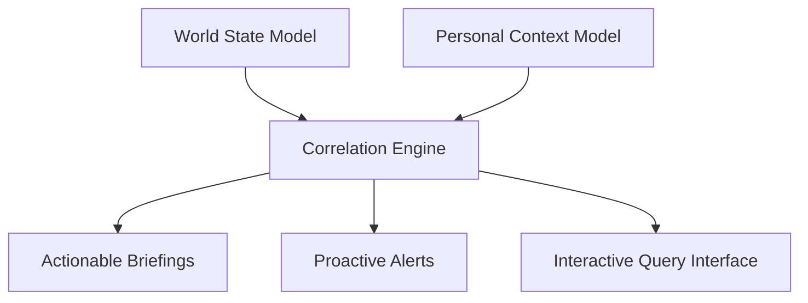

# VISION — VGT AETHEL UNIFIED PERSONAL INTELLIGENCE SYSTEM

## Mission
VGT AETHEL is a local, sovereign Personal Intelligence Operating System. It is designed to act as a trustworthy assistant, researcher, architecture partner, and situation monitor for its operator. It strictly prioritizes local execution (local-first) and local encryption (encrypted-at-rest), ensuring that no sensitive data leaves the workstation.

## Dual Context Model
Aethel operates on two primary context domains, correlating them to provide tailored warnings and reports:
1. **Personal Context Model**: User-approved context containing routines, active projects, preferred geographic areas, investments, and long-term memories.
2. **World State Model**: Observed global status including security, geopolitics, economic trends, cyber threats, and public safety.

## Cinematic Vision & Architectural Integrity
The design goals are inspired by premium sci-fi consoles (cyberpunk accents, glassmorphic HUDs), yet the underlying codebase remains simple, auditable, and secure. Aethel refuses to fabricate data or claim human-like sentience. It remains a reliable tool under full human control.
